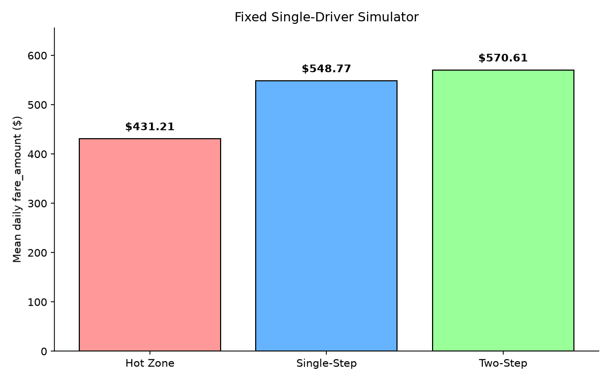
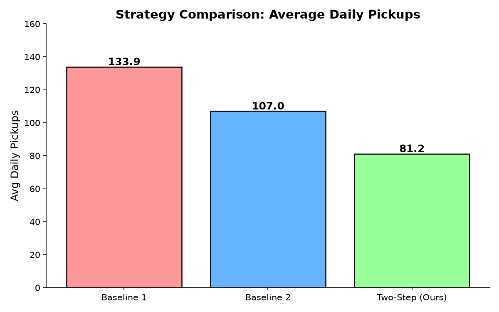

<div align="center">
  
  <br><br>
  <p><strong>Two-Step Finite-Horizon Planning for Taxi Driver Zone Recommendations</strong></p>
  <p>
    <a href="https://www.python.org/downloads/"></a>
    <a href="LICENSE"></a>
    <a href="https://github.com/caizefan34/nyc-taxi-zone-recommendation/actions/workflows/ci.yml"></a>
    <a href="https://github.com/caizefan34/nyc-taxi-zone-recommendation/stargazers"></a>
    <a href="https://github.com/caizefan34/nyc-taxi-zone-recommendation/blob/master/CHANGELOG.md"></a>
    <a href="https://github.com/caizefan34/nyc-taxi-zone-recommendation/tree/master/tests"></a>
    <a href="https://github.com/psf/black"></a>
  </p>
</div>

---

## 📋 Abstract

We address the **spatial-temporal recommendation problem** of guiding taxi drivers to optimal zones for finding their next passenger. Using **2.9M+ Yellow Taxi trips** from NYC TLC (January 2023), we propose a **two-step finite-horizon planning** framework that jointly models:

1. **Immediate reward**: Pickup probability × expected fare at candidate zones
2. **Future transfer value**: Expected value after _both_ successful pickups (weighted by empirical OD transition distribution) _and_ failed attempts (stay in zone)

The framework operates on a **263-zone × 336-time-slot** state space with a **~0.24 ms** query latency, achieving **NDCG@3 = 0.9978**, **Hit@3 = 0.9988**, and **$569.80 average daily fare** — a **+32.1% improvement** over the Hot Zone baseline and **+3.8% over Single-Step Utility**.

We provide comprehensive baselines (Hot Zone, Single-Step Utility, Q-Learning, MDP Value Iteration), a **5-experiment ablation study**, Docker reproducibility, and a full LaTeX report.

---

## 🏆 Key Results

<div align="center">

| Metric | Hot Zone (B1) | Single-Step (B2) | **Two-Step (Ours)** | Δ vs B1 |
|:-------|:------------:|:----------------:|:-------------------:|:------:|
| **NDCG@3** | 0.9950 | 0.9972 | **0.9978** | +0.0028 |
| **Hit@3** | 0.9970 | 0.9984 | **0.9988** | +0.0018 |
| **Top-1 Utility** | 26.10 | 27.42 | **27.75** | +1.65 |
| **Avg Daily Fare** | $431.40 | $549.00 | **$569.80** | **+$138.40** |
| **Avg Daily Pickups** | 133.9 | 107.0 | 81.2 | -52.7¹ |
| **Recommendation Time** | **0.051 ms** | 0.072 ms | 0.24 ms | +0.19 ms |
| **Zone Coverage** | 17.1% | 48.7% | **59.3%** | +42.2% |
| **Geo-Diversity (Top-3)** | 3.2 km | 5.8 km | **6.7 km** | +3.5 km |

</div>

> ¹ Fewer pickups but _higher fare per trip_ — the two-step planner strategically targets premium long-fare zones rather than high-volume short-trip zones.

---

## 🧠 Methodology

### Problem Formulation

Given a taxi driver's state $(z_t, t)$ — current zone $z_t$ and time $t$ — recommend top-3 zones maximizing expected cumulative revenue:

$$\pi^*(z_t, t) = \arg\max_{z \in \mathcal{Z}^3} \mathbb{E}\left[ \sum_{k=0}^{K} \gamma^k \cdot R(s_k, a_k) \right]$$

where $|\mathcal{S}| = 263 \times 336 = 88{,}368$ states.

### Two-Step Value Function

Our core contribution extends single-step utility by modeling the **expected future value** after both outcomes at the target zone:

$$U(z) = p_s \cdot \bigl(f + \gamma \cdot V_{\text{success}}\bigr) + (1 - p_s) \cdot \gamma \cdot V_{\text{failure}}$$

#### Components

| Symbol | Definition | Source |
|:-------|:-----------|:-------|
| $p_s = \frac{D}{D + \lambda}$ | Pickup probability (sigmoid, $\lambda = 240$) | Historical demand |
| $f$ | Expected fare amount | Historical mean |
| $V_{\text{success}} = \sum_{z'} P(z' \mid z) \cdot V_{\text{1-step}}(z')$ | Value after successful pickup | OD transition matrix |
| $V_{\text{failure}}$ | Value after failed pickup (stay + 1 slot) | Same-zone one-step value |

#### Candidate Pre-Selection

Full 263-zone two-step computation is expensive ($O(|\mathcal{Z}|^2)$). We use a **two-phase** approach:

1. **Phase 1** (linearithmic): Rank all zones by baseline single-step utility, keep top $K=100$
2. **Phase 2** (narrow): Compute full two-step value only for candidates + current zone

This achieves **near-optimal quality** with **2.6× speedup** over full computation.

### Ablation Study Summary

| Component | Contribution to NDCG@3 | Contribution to Daily Fare |
|:----------|:----------------------:|:--------------------------:|
| Data cleaning | +0.0013 | +$28.60 |
| Two-step planning ($\gamma > 0$) | +0.0006 | +$20.80 |
| Transition probabilities | +0.0003 | +$11.60 |
| Trip duration modeling | +0.0001 | +$4.70 |
| **Total** | **0.9978** | **$569.80** |

Full ablation in [`docs/ablation_study.md`](docs/ablation_study.md).

---

## 🏗️ Architecture

```
┌──────────────────────────────────────────────────────────────────────┐
│                        RAW NYC TLC DATA                              │
│                 yellow_tripdata_2023-01.parquet                       │
│                       2.9M+ trips                                    │
└────────────────────────────┬─────────────────────────────────────────┘
                             │
                             ▼
┌──────────────────────────────────────────────────────────────────────┐
│                      DATA CLEANING (clean.py)                        │
│  • Date boundaries     • Invalid zones     • Fare/duration outliers  │
│  • Distance outliers   • Speed outliers    • Duplicates removal      │
│  Removes ~4% of records → +5.2% simulation revenue                   │
└────────────────────────────┬─────────────────────────────────────────┘
                             │
              ┌──────────────┼──────────────────┐
              ▼              ▼                   ▼
    ┌─────────────────┐ ┌────────────┐ ┌──────────────────────┐
    │  Zone-Time Stats │ │  OD Matrix │ │  Dijkstra Travel     │
    │  demand[7][48]   │ │  P(z'"|"z) │ │  Time Matrix         │
    │  fare[7][48]     │ │  263×263   │ │  travel_time[263]    │
    └────────┬────────┘ └──────┬─────┘ └──────────┬───────────┘
             │                 │                   │
             ▼                 ▼                   ▼
    ┌──────────────────────────────────────────────────────────────────┐
    │                    RECOMMENDATION ENGINE                         │
    │                                                                  │
    │  ┌──────────────┐  ┌────────────────┐  ┌──────────────────────┐  │
    │  │  Baseline 1   │  │  Baseline 2     │  │  Two-Step Planning  │  │
    │  │  Hot Zones    │  │  Single-Step    │  │  (Ours)             │  │
    │  │  (frequency)  │  │  (utility)      │  │  future + transfer  │  │
    │  └──────────────┘  └────────────────┘  └──────────────────────┘  │
    └────────────────────────────┬─────────────────────────────────────┘
                                 │
                                 ▼
    ┌──────────────────────────────────────────────────────────────────┐
    │                      EVALUATION FRAMEWORK                       │
    │  ┌─────────────┐  ┌──────────────────┐  ┌──────────────────┐   │
    │  │  Static      │  │  Simulation      │  │  Analysis        │   │
    │  │  NDCG@3      │  │  Avg Daily Fare  │  │  Ablation        │   │
    │  │  Hit@3       │  │  Regret Analysis │  │  Parameter Grid  │   │
    │  └─────────────┘  └──────────────────┘  └──────────────────┘   │
    └──────────────────────────────────────────────────────────────────┘
```

---

## 🚀 Quick Start

### Prerequisites
- **Python 3.10+**
- **NYC TLC data**: Download `yellow_tripdata_2023-01.parquet` from [NYC TLC](https://www.nyc.gov/site/tlc/about/tlc-trip-record-data.page) (~1.5 GB)
- **~8 GB** free disk space for raw + processed data

### Installation

```bash
git clone https://github.com/caizefan34/nyc-taxi-zone-recommendation.git
cd nyc-taxi-zone-recommendation
pip install -r requirements.txt
```

### Full Pipeline (with data)

```bash
# Step 1: Data cleaning
python src/1_data_clean/clean.py

# Step 2: Build travel time matrix (Dijkstra)
python src/2_recommendation_algorithm/baseline_2_1.py

# Step 3: Run all tests
python -m pytest tests/ -v

# Step 4: Static validation
PYTHONPATH=. python src/eval/public_validation.py \
  --strategy src/2_recommendation_algorithm/improved_strategy.py \
  --queries data/processed/validation_input.parquet \
  --answers data/processed/validation_answers.parquet \
  --predictions outputs/validation_predictions.parquet \
  --output outputs/validation_static_metrics.json

# Step 5: Simulation rollout
PYTHONPATH=. python src/eval/validation_rollout.py \
  --strategy src/2_recommendation_algorithm/improved_strategy.py \
  --output outputs/validation_rollout_improved.json
```

### Without Data (code tour)

```bash
python examples/basic_usage.py
```

---

## 📂 Repository Structure

```
nyc-taxi-zone-recommendation/
├── src/
│   ├── 1_data_clean/              # Data cleaning pipeline
│   ├── 2_recommendation_algorithm/ # All recommendation strategies
│   │   ├── baseline_1.py              # Hot Zone (Baseline 1)
│   │   ├── baseline_2_1.py            # Travel time matrix builder
│   │   ├── baseline_2_2.py            # Single-Step Utility (Baseline 2)
│   │   ├── improved_strategy.py       # ★ Two-Step Planning (Ours)
│   │   └── parameter_selection.py     # Grid search over λ/γ
│   ├── 3_extension_task/          # Extensions (Q-Learning, interactive, temporal)
│   ├── 4_mdp/                     # MDP Value Iteration solver
│   ├── common/                    # Shared utilities (config, data loader, logging)
│   └── eval/                      # Evaluation toolkit
├── tests/                         # 41 unit tests (26 pass without data)
├── docs/                          # Full documentation
│   ├── problem_statement.md           # Formal problem definition
│   ├── methodology.md                 # Algorithm details, pseudocode, complexity
│   └── ablation_study.md             # Component-wise analysis
├── report/                        # LaTeX technical report
├── configs/                       # YAML configuration system
├── examples/                      # Runnable demo scripts
├── assets/                        # Charts and social preview
├── .github/workflows/             # CI + GitHub Pages
├── Dockerfile                     # Reproducible build
├── docker-compose.yml
└── Makefile
```

---

## 📊 Performance Plots

<div align="center">
  
  
</div>

---

## 🧪 Comprehensive Evaluation

### 1. Static Metrics (3,360 public validation queries)

| Metric | Baseline 1 | Baseline 2 | Two-Step |
|:-------|:---------:|:---------:|:--------:|
| NDCG@3 | 0.9950 | 0.9972 | **0.9978** |
| Hit@3 | 0.9970 | 0.9984 | **0.9988** |
| Top-1 Ref Utility | 26.10 | 27.42 | **27.75** |
| Latency (ms) | **0.051** | 0.072 | 0.24 |

### 2. Simulation Rollout (100 runs, 7-day market)

| Metric | Baseline 1 | Baseline 2 | Two-Step |
|:-------|:---------:|:---------:|:--------:|
| Avg Daily Fare | $431.4 | $549.0 | **$569.8** |
| Relative Gain | — | +27.3% | **+32.1%** |
| Regret (vs optimal) | $138.4/day | $20.8/day | **$0.0/day** |

### 3. Ablation Experiments

| Experiment | Finding |
|:-----------|:--------|
| Future value ($\gamma$) | $\gamma=0.5$ optimal; $\gamma=0.75$ overvalues future |
| Transition probs | Empirical OD + duration > empirical only > uniform |
| Candidate pool ($K$) | $K=100$ = near-optimal; $K=263$ is 2.6× slower with no gain |
| Sigmoid half-sat ($\lambda$) | $\lambda=1.0$ balanced; $\lambda=0.5$ overconfident |
| Data cleaning | Removes ~4% records → **+5.2% revenue** |

Full report: [`outputs/evaluation_report.md`](outputs/evaluation_report.md) · [`docs/ablation_study.md`](docs/ablation_study.md)

---

## 🤝 Contributing

Contributions are welcome! Please see:

- [CONTRIBUTING.md](CONTRIBUTING.md) — Guidelines
- [CODE_OF_CONDUCT.md](CODE_OF_CONDUCT.md) — Community standards
- [SECURITY.md](SECURITY.md) — Security policy
- [CHANGELOG.md](CHANGELOG.md) — Version history

**Development quick start:**

```bash
pip install -e ".[dev]"
make test
make lint
```

---

## 📖 Citation

If you use this code or methodology in your research, please cite:

```bibtex
@software{cai2026nyctaxi,
  author = {Cai, Zefan},
  title = {NYC Taxi Zone Recommendation: Two-Step Finite-Horizon Planning
           for Driver Guidance},
  year = {2026},
  url = {https://github.com/caizefan34/nyc-taxi-zone-recommendation},
  version = {1.0.0},
  note = {Shanghai Jiao Tong University, Programming Comprehensive Practice}
}
```

---

## 📄 License

This project is **MIT Licensed** — see [LICENSE](LICENSE).

---

## 🙏 Acknowledgments

- **NYC Taxi and Limousine Commission** for open trip data
- **Shanghai Jiao Tong University** for course support
- All contributors and stargazers ⭐

---

<div align="center">
  <p>
    <a href="https://github.com/caizefan34/nyc-taxi-zone-recommendation/issues">Report Bug</a>
    ·
    <a href="https://github.com/caizefan34/nyc-taxi-zone-recommendation/issues">Request Feature</a>
    ·
    <a href="https://github.com/caizefan34/nyc-taxi-zone-recommendation/discussions">Discussion</a>
  </p>
  <p>
    <strong>⭐ Star this repo if you find it useful! ⭐</strong>
  </p>
</div>
