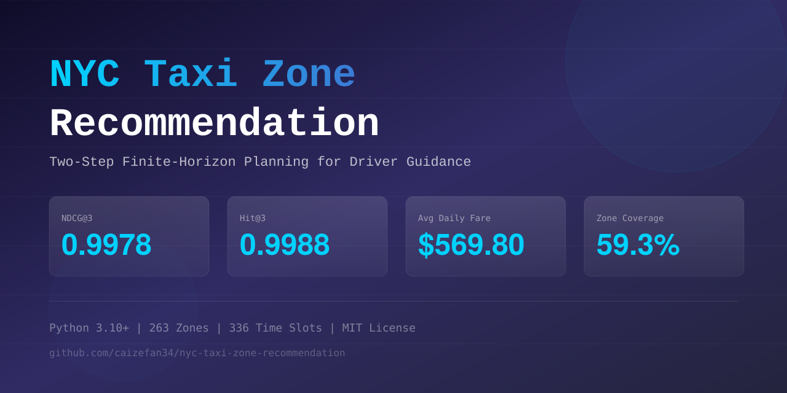

<div align="center">
  
  <p><strong>Finite-Horizon Taxi Zone Recommendation with Reproducible Evaluation</strong></p>
  <p>
    <a href="https://www.python.org/downloads/"></a>
    <a href="LICENSE"></a>
    <a href="https://github.com/caizefan34/nyc-taxi-zone-recommendation/actions/workflows/ci.yml"></a>
  </p>
</div>

## Overview

This repository studies a taxi-driver repositioning problem: given a driver's current NYC taxi zone and time, return three zones in ranked order.

The project includes:

- chronological cleaning of January 2023 NYC TLC Yellow Taxi trips;
- weekday/half-hour/zone demand and fare statistics;
- a directed OD travel-time graph and all-pairs shortest paths;
- hot-zone, single-step, and finite-horizon planning strategies;
- static reference-objective diagnostics and a fixed stochastic rollout;
- a finite-demand multi-agent simulator with explicit driver competition;
- Gymnasium-compatible DQN and Double-DQN baselines with masked candidate actions;
- paired statistical tests, horizon experiments, robustness checks, and exposure-concentration analysis;
- a corrected model-based MDP implementation;
- a reproducible simulator-trained Q-learning extension.

The repository deliberately distinguishes three different claims:

1. Static NDCG/Hit measure agreement with a supplied two-step reference objective.
2. Rollout fare measures performance only inside the supplied single-driver simulator.
3. Neither metric is a causal estimate of real-world deployment revenue.

## Reproduced results

These values come from [`outputs/reference_metrics.json`](outputs/reference_metrics.json) and are rendered into [`outputs/evaluation_report.md`](outputs/evaluation_report.md).

### Static diagnostic: 3,360 public validation queries

| Strategy | NDCG@3 | Hit@3 | Reference utility@1 |
|---|---:|---:|---:|
| Hot Zone | 0.7846 | 0.5842 | 19.4299 |
| Single-Step | 0.9024 | 0.8804 | 25.0589 |
| Two-Step | **0.9565** | **0.9714** | **27.5855** |

### Paired 100-seed, seven-day rollout

| Strategy | Mean daily `fare_amount` |
|---|---:|
| Hot Zone | $431.21 |
| Single-Step | $548.77 |
| Two-Step | **$570.61** |

Two-Step minus Single-Step is +$21.84/day in this simulator, with paired bootstrap 95% CI [$5.00, $39.53], paired t-test p=0.0151, and Cohen's dz=0.247.

This interval describes Monte Carlo seed variation in one fixed simulator. It does not capture market drift, estimation error, competing drivers, congestion, or deployment interference.

### Horizon comparison

| Horizon | NDCG@3 | Mean daily fare |
|---|---:|---:|
| 1 | **0.9582** | $569.78 |
| 2 | 0.9565 | $570.61 |
| 3 | 0.9549 | $573.47 |
| 5 | 0.9525 | **$575.97** |
| Adaptive | 0.9559 | $573.31 |

The result is intentionally reported because it shows that higher reference-objective NDCG does not imply higher simulated fare.

### Finite-demand, 50-driver benchmark

The multi-agent simulator processes simultaneous arrivals together and assigns every finite trip at most once. With demand/supply ratio 1.0 over 30 paired seven-day seeds:

| Strategy | Revenue/driver | Fulfilled trips | Utilization | Saturated attempts |
|---|---:|---:|---:|---:|
| Hot Zone | $1,233.41 | 2,965.8 | 7.31% | 95.83% |
| Single-Step | **$1,764.56** | **3,133.6** | **11.11%** | **88.39%** |
| Two-Step | $1,508.71 | 2,094.4 | 9.51% | 94.85% |

Single-Step minus Hot Zone is +$531.16 per driver, 95% paired bootstrap CI [$525.64, $536.67]. Two-Step minus Single-Step is -$255.86, 95% CI [-$259.50, -$252.30]. This reversal from the legacy single-driver rollout is evidence that recommendation concentration and competition materially change policy rankings.

At fixed fleet size, raising the configured demand/supply ratio from 0.5 to 2.0 increases Single-Step utilization from 6.42% to 18.53% and reduces saturated attempts from 95.30% to 73.06%. See [`outputs/multi_agent_benchmark.md`](outputs/multi_agent_benchmark.md).

### Simulator-trained deep RL benchmark

DQN and Double DQN train for 300 episodes on Jan 18--24 only, then run in the same 50-driver finite-demand simulator on Jan 25--31 over 20 paired evaluation seeds:

| Strategy | Revenue/driver | Fulfilled trips | Utilization |
|---|---:|---:|---:|
| Hot Zone | $1,235.71 | 2,968.7 | 7.31% |
| Single-Step | $1,768.04 | 3,134.2 | 11.15% |
| Finite Horizon | $1,511.16 | 2,094.8 | 9.52% |
| DQN | **$1,821.77** | **3,950.7** | **11.21%** |
| Double DQN | $1,742.77 | 3,410.8 | 10.69% |

DQN minus Single-Step is +$53.74 per driver, 95% paired bootstrap CI [$46.21, $61.57]. Double DQN minus Single-Step is -$25.27, CI [-$32.77, -$17.97]. These intervals cover evaluation-market seeds for one trained network per algorithm, not training uncertainty or real deployment effects. The default recommender remains unchanged. See [`outputs/rl_benchmark.md`](outputs/rl_benchmark.md).

## Method

For candidate zone `z` at arrival state `s`, the two-step score uses

$$
p(s,z)=\frac{D(s,z)}{D(s,z)+240},
$$

$$
V_1(s,z)=p(s,z)\bar f(s,z),
$$

$$
Q_2(o,z,s)=\frac{p(s,z)\left[\bar f(s,z)+\gamma\sum_{z'}P(z'\mid z)V_1(s',z')\right]
 +(1-p(s,z))\gamma V_1(s+1,z)}{m(o,z)+1}.
$$

`m(o,z)` is rounded relocation time in half-hour slots. The continuation policy waits in the reached zone; therefore this is truncated lookahead with a terminal heuristic, not a full horizon-2 Bellman-optimal policy.

The generalized implementation in [`finite_horizon.py`](src/2_recommendation_algorithm/finite_horizon.py) supports horizons 1, 2, 3, and 5 plus an adaptive stopping rule.

## Architecture

```text
official monthly TLC parquet
        |
        v
chronological raw split -> cleaning -> train_cleaned / validation_cleaned
        |                                |
        +-> zone-time demand/fare         +-> fixed validation rollout market
        +-> OD travel graph
        +-> OD transition/duration model
                    |
                    v
       baseline and finite-horizon strategies
                    |
          +---------+----------+
          v                    v
 static reference diagnostic  stochastic rollout
          |                    |
          +-> statistics, robustness, horizon, and exposure reports
```

## Setup

```bash
git clone https://github.com/caizefan34/nyc-taxi-zone-recommendation.git
cd nyc-taxi-zone-recommendation
python -m pip install -e ".[dev]"
```

Download `yellow_tripdata_2023-01.parquet` from the [NYC TLC trip record page](https://www.nyc.gov/site/tlc/about/tlc-trip-record-data.page) and place it at:

```text
data/raw/yellow_tripdata_2023-01.parquet
```

## End-to-end data pipeline

```bash
python -m scripts.run_data_pipeline --force-split
python -m scripts.build_travel_time_matrix
```

The cleaning entry point now creates the chronological uncleaned train/validation inputs directly from the official monthly parquet before applying cleaning rules.

The public `validation_input.parquet` and `validation_answers.parquet` are course evaluation artifacts; they are not generated from the TLC raw file by this repository.

## Validation

```bash
python -m src.eval.sanity_check \
  --train-cleaned data/processed/train_cleaned.parquet \
  --validation-cleaned data/processed/validation_cleaned.parquet \
  --statistics data/processed/zone_time_statistics.parquet \
  --travel-times data/processed/travel_time_matrix_dijkstra.csv \
  --baseline-1 src/2_recommendation_algorithm/baseline_1.py \
  --baseline-2 src/2_recommendation_algorithm/baseline_2_2.py \
  --strategy src/2_recommendation_algorithm/improved_strategy.py \
  --output outputs/sanity_report.json

python -m src.eval.public_validation \
  --strategy src/2_recommendation_algorithm/improved_strategy.py \
  --queries data/processed/validation_input.parquet \
  --answers data/processed/validation_answers.parquet \
  --predictions outputs/validation_predictions.parquet \
  --output outputs/validation_static_metrics.json

python -m src.eval.validation_rollout \
  --strategy src/2_recommendation_algorithm/improved_strategy.py \
  --output outputs/validation_rollout.json
```

## Research evaluation

```bash
python -m scripts.run_paired_rollout_audit --runs 100
python -m scripts.run_horizon_audit --runs 100
python -m scripts.run_research_audit
python -m scripts.run_robustness_audit
python -m scripts.generate_evaluation_report
python -m scripts.run_multi_agent_benchmark --drivers 50 --runs 30 --sensitivity-runs 10
python -m scripts.train_rl_baselines --episodes 300 --drivers 50 --runs 20
```

Real parameter selection:

```bash
python -m scripts.run_parameter_selection
```

The parameter runner evaluates every configured combination. It does not contain pre-filled metric values.

## Testing

```bash
python -m pytest tests -q
ruff check src tests scripts
```

Tests with the full local dataset cover strategy integration. Small synthetic fixtures cover raw temporal splitting, leakage checks, counterfactual estimators, statistical metrics, MDP Bellman transitions, Gymnasium contracts, DQN/Double-DQN target semantics, action masking, and seeded training reproducibility.

## Simulator boundary

The legacy rollout is useful for controlled single-driver comparison, but it has material limitations:

- one driver;
- immutable historical demand cells;
- no demand depletion;
- no competing-driver supply;
- no congestion or airport queues;
- no supply-demand feedback or equilibrium;
- fixed 60%/30%/10% compliance over the ranked Top-3.

Consequently, rollout improvements must not be presented as production revenue lift.

The multi-agent simulator addresses the first four items by using a configurable fleet, finite trip inventory, simultaneous competition, explicit demand depletion, and a configurable demand/supply ratio. It reports fulfilled trips, idle time, utilization, average driver revenue, and zone saturation. It still omits congestion, airport queue rules, endogenous passenger demand, strategic driver adaptation, and market equilibrium, so its revenue remains a simulator outcome rather than a deployment estimate.

## Counterfactual and offline-RL boundary

NYC TLC trips do not contain logged reposition recommendations, logging-policy propensities, or driver acceptance. Valid IPS, SNIPS, doubly robust, CQL, or BCQ evaluation of a reposition policy is therefore not identifiable from these records alone.

The repository provides tested IPS/SNIPS/DR formulas for future data that contain the required logging fields. The Q-learning extension is explicitly described as online Q-learning inside an estimated simulator, not offline RL.

## Exposure and market impact

On the public static queries, the two-step strategy has 70.33% weighted airport exposure, including about 55.0% at JFK. Its exposure Gini is 0.982 and effective exposure count is 5.51 zones. These values indicate substantial saturation risk that is absent from the single-driver simulator.

See the full [research-grade audit](outputs/research_grade_audit.md) and [robustness plot](outputs/audit_robustness.png).

## Repository structure

```text
src/
  1_data_clean/                 raw split, cleaning, statistics
  2_recommendation_algorithm/  baselines, two-step, finite horizons, parameter selection
  3_extension_task/            temporal analysis, sensitivity, simulator Q-learning
  eval/                         static diagnostic and legacy rollout
  simulator/multi_agent/       finite demand, competing drivers, saturation metrics
  rl/                          Gymnasium environment, DQN, Double DQN, strategy adapter
  mdp/                          corrected model-based value iteration
  audit/                        leakage, OPE formulas, statistics, fairness
scripts/                        reproducible research experiment runners
tests/                          unit and data-backed integration tests
outputs/                        checked-in report and reference metric snapshot
```

## Citation and status

This is an educational/research prototype, not a production dispatch system. If citing it, cite the repository commit used and distinguish static diagnostic metrics from simulator outcomes.

## License

MIT License. See [LICENSE](LICENSE).
