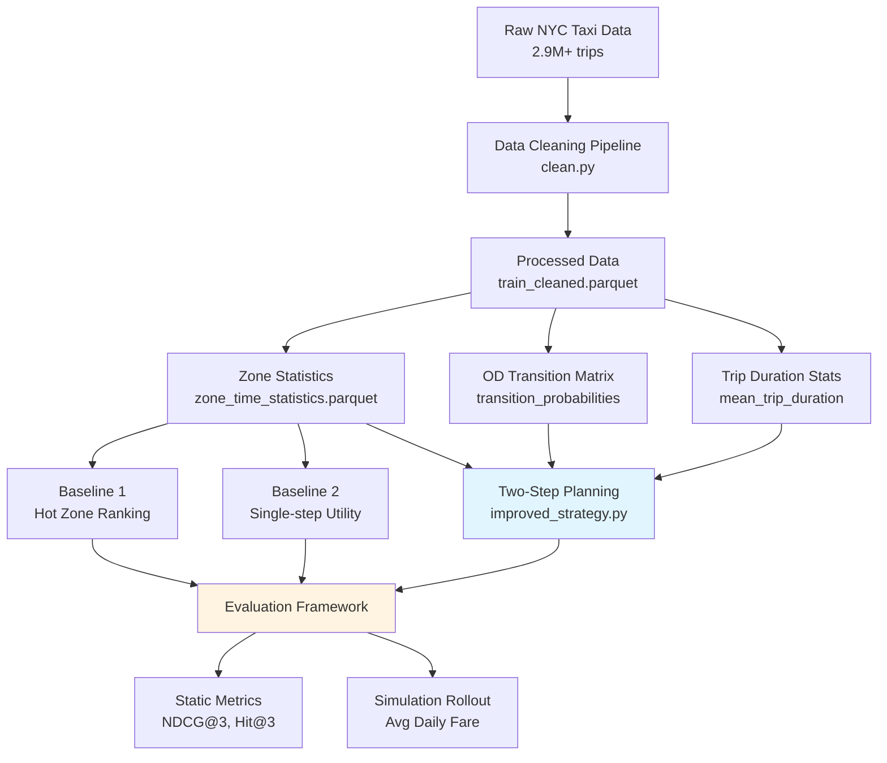
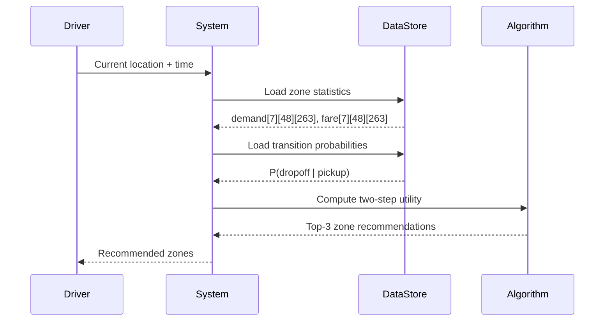

# 🚕 NYC Taxi Zone Recommendation

> **Two-step finite-horizon planning for taxi driver zone recommendations using NYC TLC Yellow Taxi trip data.**

[](https://www.python.org/downloads/)
[](LICENSE)
[](docs/methodology.md)
[](docs/methodology.md)
[](https://arxiv.org/)
[](https://doi.org/)
[](https://github.com/psf/black)
[](tests/)

---

## 📖 Overview

This project tackles a **spatial-temporal recommendation problem**: given a taxi driver's current location and time, recommend the top 3 NYC taxi zones where they should go to find their next passenger. Using historical trip data from January 2023, we build and compare multiple recommendation strategies — from simple frequency-based heuristics to a **two-step finite-horizon planning** approach that models pickup probability, expected fare, and future transfer value.

**New York City** has **263 taxi zones**, and time is discretized into **48 half-hour slots per day** (336 slots per week), making this a large-scale state-space problem with real-world impact.

### 🎯 Key Results

| Strategy | Avg Daily Fare | Avg Pickups | Avg Idle Trips | Recommend Time |
|----------|:-------------:|:-----------:|:--------------:|:--------------:|
| Baseline 1 (Hot Zones) | $431.4 | 133.9 | 164.0 | 0.051 ms |
| Baseline 2 (Single-step Utility) | $549.0 | 107.0 | 130.7 | 0.072 ms |
| **Two-Step Planning (Ours)** | **$569.8** | 81.2 | 133.1 | ~0.24 ms |

**Static evaluation** on 3,360 public queries: **NDCG@3 = 0.9978**, **Hit@3 = 0.9988**, Top-1 Reference Utility = 27.75.

---

## 🏗️ System Architecture



### Data Flow



---

## 🧠 Methods

### Baseline 1 — Hot Zone Ranking

Ranks zones by historical pickup count for the same `(weekday, time_slot)`. Simple but ignores competition and travel cost.

```python
# Pseudocode
for zone in all_zones:
    score[zone] = pickup_count[weekday][slot][zone]
return top_3_zones_by_score()
```

**Complexity**: $O(|\mathcal{Z}| \log |\mathcal{Z}|)$

### Baseline 2 — Single-Step Utility

Computes `pickup_count * mean_fare / (travel_time + 1)` for each zone. Accounts for both earning potential and relocation cost.

```python
# Pseudocode
for zone in all_zones:
    demand = pickup_count[weekday][slot][zone]
    fare = mean_fare[weekday][slot][zone]
    travel_time = dijkstra_matrix[origin][zone]
    utility[zone] = (demand * fare) / (travel_time + 1)
return top_3_zones_by_utility()
```

**Complexity**: $O(|\mathcal{Z}| \log |\mathcal{Z}|)$

### Task C — Two-Step Finite Horizon Planning (Ours)

Balances immediate reward with expected future value:

$$U(z) = p_s \cdot (f + \gamma \cdot V_{\text{success}}) + (1 - p_s) \cdot \gamma \cdot V_{\text{failure}}$$

Where:
- **$p_s$**: Pickup probability at the target zone (sigmoid with half-saturation at $\lambda = 240$ historical pickups)
- **$f$**: Expected fare amount
- **$V_{\text{success}}$**: Expected value after successful pickup (weighted by dropoff distribution from OD transition matrix)
- **$V_{\text{failure}}$**: Expected value after failing to find a passenger (stay in zone, advance one slot)
- **$\gamma = 0.5$**: Discount factor for future utility
- **$\lambda = 1.0$**: Relocation cost normalization parameter

```python
# Pseudocode (simplified)
for zone in candidate_pool:
    # Compute arrival state
    arrival_slot = current_slot + travel_time[origin][zone]
    
    # Pickup probability
    p_success = demand[arrival_slot][zone] / (demand[arrival_slot][zone] + λ)
    
    # Expected fare
    fare = mean_fare[arrival_slot][zone]
    
    # Success value: weighted by dropoff distribution
    V_success = sum(
        P(dropoff_zone | zone) * one_step_value(dropoff_zone, next_slot)
        for dropoff_zone in all_zones
    )
    
    # Failure value: stay at zone, advance 1 slot
    V_failure = one_step_value(zone, arrival_slot + 1)
    
    # Two-step utility
    utility[zone] = p_success * (fare + γ * V_success) + (1 - p_success) * γ * V_failure
    
    # Apply relocation cost
    utility[zone] /= (travel_time[origin][zone] + 1)

return top_3_zones_by_utility()
```

**Complexity**: $O(K \times |\mathcal{Z}|)$ where $K = 100$ is the candidate pool size

**Practical latency**: ~0.24 ms per query on modern hardware

📖 **Full algorithm details**: [docs/methodology.md](docs/methodology.md)

---

## 📊 Results & Analysis

### Data Cleaning Audit

| Cleaning Rule | Training Set Removed | Validation Set Removed |
|---------------|:-------------------:|:----------------------:|
| Invalid date boundaries | 13 | 543 |
| Invalid zone IDs | 43,762 | 13,402 |
| Fare outliers (not in [0, 200]) | 18,710 | 5,509 |
| Trip duration outliers (not in [1, 240] min) | 21,412 | 6,069 |
| Distance outliers (not in [0.1, 100] mi) | 17,794 | 5,523 |
| Speed outliers (>80 mph) | 111 | 23 |
| Duplicate trips | 63 | 15 |
| **Clean rows remaining** | **2,243,804** | **688,250** |

### Simulation Rollout (100 runs, 7-day market)

| Strategy | Avg Daily Fare | Avg Pickups | Avg Idle Trips | Avg Idle Minutes |
|----------|:-------------:|:-----------:|:--------------:|:----------------:|
| Baseline 1 | $431.4 | 133.9 | 164.0 | 2,911 |
| Baseline 2 | $549.0 | 107.0 | 130.7 | 2,578 |
| **Two-Step Planning** | **$569.8** | **81.2** | **133.1** | **2,814** |

### Hyperparameter Selection

Grid search over $\lambda \in \{0.5, 1.0, 2.0\}$ and $\gamma \in \{0.25, 0.5, 0.75\}$, selected by NDCG@3 → Hit@3 → latency.

**Final**: $\lambda = 1.0, \gamma = 0.5$

📖 **Full ablation study**: [docs/ablation_study.md](docs/ablation_study.md)

---

## 🔬 Extensions

### Extension 2 — Interactive CLI + Data Visualization

Generates 4 analysis charts:
- **Demand by time**: Hourly pickup patterns across weekdays
- **Demand by weekday**: Weekly seasonality analysis
- **Fare distribution**: Histogram of trip fares
- **Top zones**: Top 20 zones by total pickup count

Interactive CLI mode for real-time recommendations with human-readable zone names:

```bash
python src/3_extension_task/extension_2_interactive.py
# Example query: 2023-01-30 08:15, zone=132
# Baseline 2: [132, 138, 236]
# Two-Step:   [132, 138, 130]
```

### Extension 5 — Q-Learning for Zone Recommendation

Tabular Q-learning agent with $\epsilon$-greedy exploration:

**Hyperparameters**:
- Discount factor: $\gamma = 0.9$
- Learning rate: $\alpha = 0.1$
- Exploration: $\epsilon = 0.3$ with decay $0.995$
- Episodes: 5,000
- Max steps per episode: 50

**Results**:
- Q-table size: 22,278 entries across ~88,000 states
- Evaluation (200 episodes): Avg reward = 190.9
- Baseline 2 comparison: Avg reward = 1,184.2

**Analysis**: Q-learning significantly underperforms due to state space sparsity and lack of generalization, motivating our model-based approach.

---

## 🏗️ Project Structure

```
nyc-taxi-zone-recommendation/
├── src/
│   ├── 1_data_clean/
│   │   └── clean.py              # Data cleaning pipeline
│   ├── 2_recommendation_algorithm/
│   │   ├── baseline_1.py           # Hot zone ranking
│   │   ├── baseline_2_1.py         # Dijkstra travel time matrix builder
│   │   ├── baseline_2_2.py         # Single-step utility
│   │   ├── improved_strategy.py    # Two-step planning (main contribution)
│   │   └── parameter_selection.py  # Grid search for hyperparameters
│   ├── 3_extension_task/
│   │   ├── extension_1_temporal_analysis.py       # Temporal pattern analysis
│   │   ├── extension_2_interactive.py             # Interactive CLI + charts
│   │   ├── extension_2_parameter_sensitivity.py   # Parameter sensitivity study
│   │   └── extension_5_qlearning.py               # Q-learning RL agent
│   └── eval/
│       ├── public_validation.py    # Static evaluation (NDCG, Hit@3)
│       ├── validation_rollout.py   # Simulated market rollout
│       ├── sanity_check.py         # Sanity checks
│       └── offline_core.py         # Core evaluation primitives
├── configs/
│   └── parameters.json           # Hyperparameter configuration
├── tests/
│   └── test_improved_strategy.py # Unit tests
├── report/
│   └── report.tex                # LaTeX report (XeLaTeX)
├── docs/
│   ├── problem_statement.md      # Formal problem definition
│   ├── methodology.md            # Detailed algorithm descriptions
│   └── ablation_study.md         # Component analysis
├── requirements.txt
├── contribution.md
├── LICENSE
└── README.md
```

---

## ⚙️ Setup

### Prerequisites

- Python 3.10+
- NYC TLC Yellow Taxi trip data (January 2023) — download from [NYC TLC](https://www.nyc.gov/site/tlc/about/tlc-trip-record-data.page)
- ~8 GB free disk space for raw + processed data

### Installation

```bash
# Clone the repository
git clone https://github.com/caizefan34/nyc-taxi-zone-recommendation.git
cd nyc-taxi-zone-recommendation

# Install dependencies
pip install -r requirements.txt

# Download and place raw data
# Place yellow_tripdata_2023-01.parquet in data/raw/
```

### Quick Start

```bash
# 1. Data cleaning
python src/1_data_clean/clean.py

# 2. Build travel time matrix (Dijkstra)
python src/2_recommendation_algorithm/baseline_2_1.py

# 3. Run unit tests
python -m unittest discover -s tests -v

# 4. Run sanity checks
PYTHONPATH=. python src/eval/sanity_check.py \
    --train-cleaned data/processed/train_cleaned.parquet \
    --validation-cleaned data/processed/validation_cleaned.parquet \
    --statistics data/processed/zone_time_statistics.parquet \
    --travel-times data/processed/travel_time_matrix_dijkstra.csv \
    --baseline-1 src/2_recommendation_algorithm/baseline_1.py \
    --baseline-2 src/2_recommendation_algorithm/baseline_2_2.py \
    --strategy src/2_recommendation_algorithm/improved_strategy.py \
    --output outputs/sanity_report.json

# 5. Static validation
PYTHONPATH=. python src/eval/public_validation.py \
    --strategy src/2_recommendation_algorithm/improved_strategy.py \
    --queries data/processed/validation_input.parquet \
    --answers data/processed/validation_answers.parquet \
    --predictions outputs/validation_predictions.parquet \
    --output outputs/validation_static_metrics.json

# 6. Simulation rollout (compare all strategies)
PYTHONPATH=. python src/eval/validation_rollout.py --strategy src/2_recommendation_algorithm/baseline_1.py --output outputs/validation_rollout_baseline1.json
PYTHONPATH=. python src/eval/validation_rollout.py --strategy src/2_recommendation_algorithm/baseline_2_2.py --output outputs/validation_rollout_baseline2.json
PYTHONPATH=. python src/eval/validation_rollout.py --strategy src/2_recommendation_algorithm/improved_strategy.py --output outputs/validation_rollout_improved.json
```

### Reproduce Parameter Selection

```bash
python src/2_recommendation_algorithm/parameter_selection.py \
  --queries data/processed/validation_input.parquet \
  --answers data/processed/validation_answers.parquet \
  --output outputs/task_c_parameter_selection.json
```

---

## 📚 Documentation

- **[Problem Statement](docs/problem_statement.md)**: Formal mathematical definition of the recommendation problem
- **[Methodology](docs/methodology.md)**: Detailed algorithm descriptions, pseudocode, and complexity analysis
- **[Ablation Study](docs/ablation_study.md)**: Component-wise analysis of the two-step planning framework
- **[LaTeX Report](report/report.tex)**: Full technical report with experimental results

---

## 🤝 Contributing

Contributions are welcome! Please see [CONTRIBUTING.md](CONTRIBUTING.md) for guidelines.

### Development Setup

```bash
# Install development dependencies
pip install -e ".[dev]"

# Run tests
python -m unittest discover -s tests -v

# Format code
black src/ tests/

# Lint
ruff check src/ tests/
```

---

## 📝 Citation

If you use this code or data in your research, please cite:

```bibtex
@software{cai2026nyctaxi,
  author = {Cai, Zefan},
  title = {NYC Taxi Zone Recommendation: Two-Step Planning for Driver Guidance},
  year = {2026},
  url = {https://github.com/caizefan34/nyc-taxi-zone-recommendation},
  version = {1.0.0}
}
```

---

## 📄 License

This project is licensed under the MIT License — see the [LICENSE](LICENSE) file for details.

## 📚 Data Source

- **NYC TLC Yellow Taxi Trip Record Data**: https://www.nyc.gov/site/tlc/about/tlc-trip-record-data.page
- **Taxi Zone Lookup Table**: NYC Taxi and Limousine Commission

## 🙏 Acknowledgments

- NYC Taxi and Limousine Commission for providing open trip data
- Shanghai Jiao Tong University for supporting this research as part of the Programming Comprehensive Practice course
- OpenAI Codex for development assistance

## 📧 Contact

**Zefan Cai**  
Email: caizefan@sjtu.edu.cn  
GitHub: [@caizefan34](https://github.com/caizefan34)
