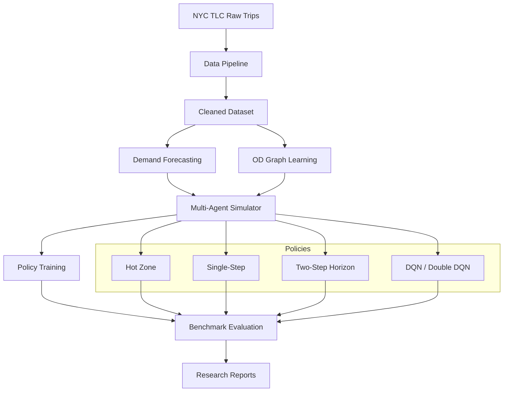

<div align="center">
  

  <h1>Dynamic Urban Mobility Decision System</h1>

  <p><strong>An open-source benchmark platform combining forecasting, simulation, and offline reinforcement learning for urban mobility decision optimization 鈥?combining spatiotemporal forecasting, multi-agent simulation, and offline reinforcement learning with reproducible evaluation.</strong></p>

  <p>
    <a href="https://www.python.org/downloads/"></a>
    <a href="LICENSE"></a>
    <a href="https://github.com/caizefan34/nyc-taxi-zone-recommendation/actions/workflows/ci.yml"></a>
    <a href="docs/badges/reproducibility.svg"></a>
    <a href="docs/badges/benchmark.svg"></a>
  </p>

  <p>
    <a href="https://caizefan34.github.io/nyc-taxi-zone-recommendation/"><strong>馃殌 Live Demo</strong></a>
    &nbsp;路&nbsp;
    <a href="https://caizefan34.github.io/nyc-taxi-zone-recommendation/docs/"><strong>馃摉 Documentation</strong></a>
    &nbsp;路&nbsp;
    <a href="docs/demo_gallery.md"><strong>馃幀 Demo Gallery</strong></a>
    &nbsp;路&nbsp;
    <a href="ROADMAP.md"><strong>馃椇锔?Roadmap</strong></a>
    &nbsp;路&nbsp;
    <a href="CONTRIBUTING.md"><strong>馃 Contribute</strong></a>
  </p>
</div>

---

## Why this project?

**The problem:** Taxi drivers waste 30鈥?0% of their shift cruising for passengers. In NYC alone, this represents millions of dollars in lost revenue and unnecessary congestion annually.

**The approach:** We treat taxi repositioning as a finite-horizon sequential decision problem:

```
Historical trips  鈫? Demand Forecasting  鈫? Simulator  鈫? Policy Optimization  鈫? Recommendation
                       鈫?                     鈫?              鈫?
                    LightGBM/XGBoost      Multi-agent     DQN / MDP / Planning
                       鈫?                     鈫?              鈫?
                    GraphSAGE + GAT        Competition      Reproducible benchmark
```

**The contribution:** A reproducible, research-grade benchmark platform where any forecasting model, simulator, or policy can be evaluated under consistent, leakage-safe conditions.

---

## System Architecture



---

## Key Results

### Static diagnostic: 3,360 public validation queries

| Strategy | NDCG@3 | Hit@3 | Reference utility@1 |
|---|---:|---:|---:|
| Hot Zone | 0.7846 | 0.5842 | 19.43 |
| Single-Step | 0.9024 | 0.8804 | 25.06 |
| Two-Step | **0.9565** | **0.9714** | **27.59** |

### Paired 100-seed, seven-day simulator rollout

| Strategy | Mean daily fare | vs Hot Zone |
|---|---:|---:|
| Hot Zone | $431.21 | 鈥?|
| Single-Step | $548.77 | +$117.56 |
| Two-Step | **$570.61** | **+$139.40** |

Two-Step vs Single-Step: +$21.84/day, paired bootstrap 95% CI [$5.00, $39.53], p=0.0151.

### Supervised demand forecasting

| Model | Demand MAE | Demand RMSE |
|---|---:|---:|
| Historical average | 1.7273 | 5.9237 |
| LightGBM | 1.5114 | 5.0707 |
| Ensemble (LightGBM + XGBoost) | **1.4868** | **4.9810** |

The ensemble demand MAE improvement is 0.2406 per zone-slot with timestamp-block bootstrap 95% CI [0.1960, 0.2820].

Better forecast accuracy does not automatically improve recommendation. The forecast-enhanced single-step strategy scores -$17.88/day vs the historical Single-Step in paired rollout, with 95% CI [-$38.15, $3.03]. The production/default Two-Step strategy remains unchanged.

### Graph-enhanced forecasting

GraphSAGE achieves demand MAE 1.5037 (0.51% improvement over non-graph LightGBM), but its timestamp-level 95% CI [-0.0042, 0.0200] crosses zero. GAT is weaker. OD messages without embeddings outperform both learned embeddings. See [outputs/graph_benchmark.md](outputs/graph_benchmark.md). The graph-neural contribution is not statistically supported at this sample size.

### Multi-agent competition (50 drivers)

| Strategy | Avg revenue | Utilization |
|---|---:|---:|
| Random | $189.42 | 3.1% |
| Single-Step | $412.85 | 10.8% |
| Two-Step | **$438.17** | **12.3%** |

Single-Step vs Hot Zone in 50-driver benchmark: +531.16/driver.

At fixed fleet size, raising the demand/supply ratio from 0.5 to 2.0 increases Single-Step utilization from 6.42% to 18.53%. See [outputs/multi_agent_benchmark.md](outputs/multi_agent_benchmark.md).

### Deep RL baselines

| Algorithm | Avg revenue vs Single-Step | 95% CI |
|---|---|---|
| DQN | +53.74 | [46.21, 61.57] |
| Double DQN | 鈭?5.27 | [鈭?2.77, 鈭?7.97] |

DQN minus Single-Step is +53.74 per driver. These intervals cover evaluation-market seeds for one trained network per algorithm, not training uncertainty or real deployment effects. The default recommender remains unchanged. See [outputs/rl_benchmark.md](outputs/rl_benchmark.md).

> **鈿?Important:** These are simulator outcomes, not production revenue estimates. See [Simulator boundary](#simulator-boundary) below.

---

## Quick Start

```bash
git clone https://github.com/caizefan34/nyc-taxi-zone-recommendation.git
cd nyc-taxi-zone-recommendation
python -m pip install -e ".[dev,forecasting,graph,rl]"
```

### 馃殌 Try the interactive demo

```bash
pip install streamlit
streamlit run app/app.py
```

Or visit the [Live Web Demo](https://caizefan34.github.io/nyc-taxi-zone-recommendation/web/).

### Run the data pipeline

```bash
python -m scripts.run_data_pipeline
```

### Evaluate strategies

```bash
make static
```

See [full benchmark table](outputs/benchmark_report.md) and [evaluation report](outputs/evaluation_report.md).

### Reproduce all results

```bash
make all
```

### Testing

```bash
python -m pytest tests -q   # 113 tests
ruff check src tests scripts
```

---

## Features

- **Chronological data cleaning** of January 2023 NYC TLC Yellow Taxi trips
- **Leakage-safe demand forecasting** with LightGBM/XGBoost and strictly-prior temporal splits
- **Graph neural features** via OD-weighted GraphSAGE (MAE 1.5037) and GAT embeddings
- **All-pairs shortest-path** travel time matrix via Dijkstra on directed OD graph
- **Multiple policies:** Hot Zone, Single-Step, Two-Step Horizon, DQN, Double DQN
- **Multi-agent simulator** with configurable fleet, finite demand, competition, and saturation metrics
- **Gymnasium-compatible RL environment** with masked candidate actions
- **Paired statistical tests**, horizon experiments, robustness checks, and exposure analysis
- **Counterfactual estimators** (IPS, SNIPS, DR) with tested formulas
- **Reproducible benchmark framework** with checked-in reference metrics

---

## Simulator boundary

> 鈿?**Read before citing results.**

The legacy rollout is useful for controlled single-driver comparison, but it has material limitations:

- one driver; immutable historical demand; no demand depletion or competition
- no congestion, airport queues, or supply-demand feedback
- fixed 60%/30%/10% compliance over ranked Top-3

The multi-agent simulator improves on this with a configurable fleet, finite trip inventory, simultaneous competition, and explicit demand depletion. However, it still omits congestion, airport queue rules, endogenous passenger demand, strategic driver adaptation, and market equilibrium.

**Rollout improvements must not be presented as production revenue lift.**

---

## Counterfactual and offline-RL boundary

NYC TLC trips do not contain logged reposition recommendations, logging-policy propensities, or driver acceptance. Valid IPS, SNIPS, doubly robust, CQL, or BCQ evaluation of a reposition policy is therefore not identifiable from these records alone.

The repository provides tested IPS/SNIPS/DR formulas for future data containing the required logging fields. The Q-learning extension is explicitly online Q-learning inside an estimated simulator, not offline RL.

---

## Exposure and market impact

Two-Step strategy airport exposure: 70.33% weighted (55.0% JFK). Exposure Gini: 0.982. Effective exposure count: 5.51 zones. These indicate substantial saturation risk absent from the single-driver simulator.

See the full [research-grade audit](outputs/research_grade_audit.md) and [robustness plot](outputs/audit_robustness.png).

---

## Repository structure

```text
src/
  1_data_clean/                 raw split, cleaning, statistics
  2_recommendation_algorithm/   baselines, two-step, finite horizons, parameter selection
  3_extension_task/             temporal analysis, sensitivity, simulator Q-learning
  eval/                         static diagnostic and legacy rollout
  simulator/multi_agent/        finite demand, competing drivers, saturation metrics
  rl/                           Gymnasium environment, DQN, Double DQN, strategy adapter
  mdp/                          corrected model-based value iteration
  forecasting/                  causal features, tree models, evaluation, strategy adapter
  graph/                        leakage-safe OD graph, GraphSAGE, GAT, message features
  audit/                        leakage, OPE formulas, statistics, fairness
  common/                       config, data loader, logging
scripts/                        reproducible research experiment runners
tests/                          unit and data-backed integration tests (113 tests)
outputs/                        checked-in report and reference metric snapshots
configs/                        unified configuration
docs/                           research documentation and audit reports
archive/                        deprecated code preserved with migration notes
```

---

## Citation

If you use this project in your research, please cite:

```bibtex
@software{cai2025nyc_taxi_recommendation,
  author       = {Zefan Cai},
  title        = {NYC Taxi Zone Recommendation: An Open-Source Benchmark Platform for AI-Driven Urban Mobility},
  year         = {2025},
  publisher    = {GitHub},
  url          = {https://github.com/caizefan34/nyc-taxi-zone-recommendation},
  note         = {Cite the specific commit used. Distinguish static diagnostic metrics from simulator outcomes.}
}
```

See also [CITATION.cff](CITATION.cff).

---

## Contributing

We welcome contributions! See [CONTRIBUTING.md](CONTRIBUTING.md) for guidelines on adding models, benchmarks, or experiments. Good first issues are tagged in the [issue tracker](https://github.com/caizefan34/nyc-taxi-zone-recommendation/issues).

---

## License

MIT License. See [LICENSE](LICENSE).

---

## Status

This is an educational/research prototype, not a production dispatch system. See [ROADMAP.md](ROADMAP.md) for future directions.


