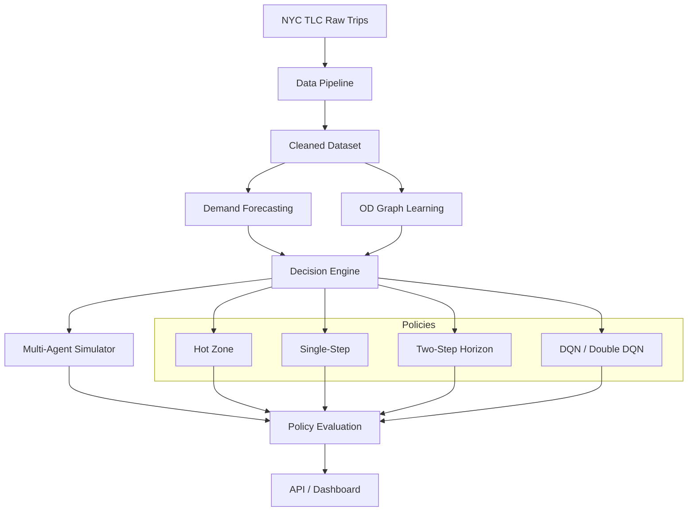

<div align="center">
  

  <h1>Urban Mobility Decision Intelligence</h1>

  <p><strong>An open-source decision intelligence platform for dynamic fleet repositioning — combining demand forecasting, multi-agent simulation, reinforcement learning, and reproducible evaluation.</strong></p>

  <p>
    <a href="https://www.python.org/downloads/"></a>
    <a href="LICENSE"></a>
    <a href="https://github.com/caizefan34/nyc-taxi-zone-recommendation/actions/workflows/ci.yml"></a>
    <a href="docs/badges/reproducibility.svg"></a>
    <a href="docs/badges/benchmark.svg"></a>
    <a href="#quick-start"></a>
    <a href="CONTRIBUTING.md"></a>
  </p>

  <p>
    <a href="https://caizefan34.github.io/nyc-taxi-zone-recommendation/web/"><strong>Live Demo</strong></a>
    &nbsp;·&nbsp;
    <a href="https://caizefan34.github.io/nyc-taxi-zone-recommendation/docs/"><strong>Documentation</strong></a>
    &nbsp;·&nbsp;
    <a href="#quick-start"><strong>API</strong></a>
    &nbsp;·&nbsp;
    <a href="#docker"><strong>Docker</strong></a>
    &nbsp;·&nbsp;
    <a href="ROADMAP.md"><strong>Roadmap</strong></a>
  </p>
</div>

---

## Platform Overview

```
Historical/Real-time Mobility Data
          ↓
   Demand Forecasting
          ↓
 Supply-Demand Modeling
          ↓
  Mobility Simulation
          ↓
 Decision / Policy Engine
          ↓
   Fleet Optimization
          ↓
Recommendation / API / Dashboard
          ↓
Shadow Evaluation / A-B Testing
```

**NYC Taxi** is the reference implementation. The architecture generalizes to any city with zone-based trip data: Chicago, London, Singapore, ride-hailing, delivery, autonomous fleets.

---

## Why this project?

**The problem:** Taxi drivers waste 30-60% of their shift cruising for passengers. In NYC alone, this represents millions of dollars in lost revenue and unnecessary congestion annually.

**The approach:** We treat fleet repositioning as a sequential decision problem combining forecasting, simulation, and optimization:

```
Historical trips  →  Demand Forecasting  →  Simulator  →  Policy Optimization  →  Recommendation
                       ↓                      ↓               ↓
                    LightGBM/XGBoost      Multi-agent     DQN / MDP / Planning
                       ↓                      ↓               ↓
                    GraphSAGE + GAT        Competition      Reproducible benchmark
```

**The contribution:** A reproducible, research-grade platform where forecasting models, simulators, and policies can be evaluated under consistent, leakage-safe conditions — plus production-style API and Docker deployment for pilot readiness.

---

## Quick Start

### Docker (one command)

```bash
docker compose up
# API → http://localhost:8000/docs
# Demo → http://localhost:8501
```

### Local

```bash
git clone https://github.com/caizefan34/nyc-taxi-zone-recommendation.git
cd nyc-taxi-zone-recommendation
pip install -e ".[dev,api,demo]"

# API
uvicorn src.api.main:app --host 0.0.0.0 --port 8000

# Demo
streamlit run app/app.py
```

### Quick API Example

```bash
curl -X POST http://localhost:8000/v1/recommendations \
  -H "Content-Type: application/json" \
  -d '{"vehicle_id": "v001", "zone_id": 161}'
```

```json
{
  "recommendation": {
    "vehicle_id": "v001",
    "current_zone": 161,
    "recommended_zone": 132,
    "confidence": 0.87,
    "ranked_zones": [
      {"zone_id": 132, "score": 0.91, "expected_demand": 41.7},
      {"zone_id": 236, "score": 0.85, "expected_demand": 38.2}
    ],
    "model_version": "two-step-v1"
  },
  "metadata": {
    "source": "simulation/historical_replay"
  }
}
```

---

## Key Results

### Static diagnostic: 3,360 public validation queries

| Strategy | NDCG@3 | Hit@3 | Reference utility@1 |
|---|---:|---:|---:|
| Hot Zone | 0.7846 | 0.5842 | 19.43 |
| Single-Step | 0.9024 | 0.8804 | 25.06 |
| Two-Step | **0.9565** | **0.9714** | **27.59** |

### Paired 100-seed, seven-day simulator rollout

| Strategy | Mean daily fare | vs Hot Zone |
|---|---:|---:|
| Hot Zone | $431.21 | — |
| Single-Step | $548.77 | +$117.56 |
| Two-Step | **$570.61** | **+$139.40** |

Two-Step vs Single-Step: +$21.84/day, paired bootstrap 95% CI [$5.00, $39.53], p=0.0151.

### Supervised demand forecasting

| Model | Demand MAE | Demand RMSE |
|---|---:|---:|
| Historical average | 1.7273 | 5.9237 |
| LightGBM | 1.5114 | 5.0707 |
| Ensemble (LightGBM + XGBoost) | **1.4868** | **4.9810** |

> Better forecast accuracy does not automatically improve recommendation. The forecast-enhanced single-step strategy scores -$17.88/day vs the historical Single-Step. See [Decision-Aware Forecasting](docs/research/decision_aware_forecasting.md).

### Graph-enhanced forecasting

GraphSAGE achieves demand MAE 1.5037 (0.51% improvement over non-graph LightGBM), but its timestamp-level 95% CI [-0.0042, 0.0200] crosses zero. GAT is weaker. OD messages without embeddings outperform both learned embeddings. See [outputs/graph_benchmark.md](outputs/graph_benchmark.md). The graph-neural contribution is not statistically supported at this sample size.

### Multi-agent competition (50 drivers)

| Strategy | Avg revenue | Utilization |
|---|---:|---:|
| Random | $189.42 | 3.1% |
| Single-Step | $412.85 | 10.8% |
| Two-Step | **$438.17** | **12.3%** |

Single-Step vs Hot Zone in 50-driver benchmark: +531.16/driver.

At fixed fleet size, raising the demand/supply ratio from 0.5 to 2.0 increases Single-Step utilization from 6.42% to 18.53%. See [outputs/multi_agent_benchmark.md](outputs/multi_agent_benchmark.md).

### Deep RL baselines

| Algorithm | Avg revenue vs Single-Step | 95% CI |
|---|---|---|
| DQN | +53.74 | [46.21, 61.57] |
| Double DQN | -25.27 | [-32.77, -17.97] |

DQN minus Single-Step is +53.74 per driver. These intervals cover evaluation-market seeds for one trained network per algorithm, not training uncertainty or real deployment effects. The default recommender remains unchanged. See [outputs/rl_benchmark.md](outputs/rl_benchmark.md).

> **Important:** These are simulator outcomes, not production revenue estimates. See [Scientific Limitations](#scientific-limitations) below.

---

## System Architecture



---

## Platform Capabilities

### Research
- Leakage-safe demand forecasting with LightGBM/XGBoost and strictly-prior temporal splits
- Graph neural features via OD-weighted GraphSAGE and GAT
- Multiple policies: Hot Zone, Single-Step, Two-Step Horizon, DQN, Double DQN
- Multi-agent simulator with configurable fleet, finite demand, competition
- Paired statistical tests, robustness checks, exposure analysis
- Counterfactual estimators (IPS, SNIPS, DR)

### Engineering
- **REST API** (FastAPI) — `/health`, `/ready`, `/v1/recommendations`, `/v1/demand/forecast`
- **Docker** — `docker compose up` for API + Demo
- **Decision Engine** — Unified recommendation schema with rich metadata
- **Shadow Evaluation** — Compare AI vs actual without execution
- **A/B Testing Framework** — Bootstrap CIs, effect size, statistical significance
- **Model Registry** — File-based versioning with training metadata
- **Cross-city abstraction** — CityAdapter interface; NYC reference implementation
- **Observability** — Structured logging, request latency tracking, metrics snapshot

---

## Repository Structure

```text
src/
  decision/              Decision Engine (unified recommendation)
  api/                   FastAPI REST API
  evaluation/            Shadow, A/B, historical replay
  cities/                Cross-city abstraction (NYC adapter)
  monitoring/            Metrics, model registry
  forecasting/           LightGBM, XGBoost, feature pipeline
  graph/                 GraphSAGE, GAT, OD graph
  simulator/             Multi-agent v1 + v2, calibration
  rl/                    Gymnasium env, DQN/DoubleDQN, offline RL
  mdp/                   Model-based value iteration
  common/                Config, data loader, logging
  interfaces/            ABCs, adapters, model registry
  1_data_clean/          Original data pipeline (preserved)
  2_recommendation_algorithm/  Original strategies (preserved)
  3_extension_task/      Original extensions (preserved)
scripts/                 Experiment runners and utilities
tests/                   Method and regression test suite (see CI for current status)
configs/                 Configuration profiles
docs/                    Documentation and audit reports
```

---

## Scientific Limitations

> **Read before citing results.**

### Simulator boundary

The multi-agent simulator improves on single-driver rollouts with a configurable fleet, finite trip inventory, and explicit competition. However, it still omits:
- Congestion and traffic dynamics
- Airport queue rules
- Endogenous passenger demand
- Strategic driver adaptation
- Market equilibrium effects

**Rollout improvements must not be presented as production revenue lift.**

### Counterfactual boundary

NYC TLC trips do not contain logged reposition recommendations, logging-policy propensities, or driver acceptance. Valid IPS, SNIPS, or doubly robust evaluation is therefore not identifiable from these records alone.

### Forecast-decision gap

Better forecast accuracy (lower MAE/RMSE) has been shown NOT to improve recommendation decisions in this domain. The platform explicitly separates forecast and decision metrics.

### Exposure and market impact

Two-Step strategy airport exposure: 70.33% weighted. Exposure Gini: 0.982. These indicate substantial saturation risk at scale — a key research question for the platform.

---

## Docker

```bash
# Start API + Demo
docker compose up

# API documentation
open http://localhost:8000/docs

# Demo dashboard
open http://localhost:8501
```

See [.env.example](.env.example) for configuration.

---

## Reproduce Research Results

```bash
# Data pipeline
python -m scripts.run_data_pipeline --force-split
python -m scripts.build_travel_time_matrix

# Static evaluation
make static

# Full benchmark
make all

# Tests
pytest tests -q

# Simulator-only trajectory-aware OPE benchmark
python -m scripts.run_ope_comparison --seed 42
```

See [docs/reproduction.md](docs/reproduction.md) for detailed instructions.

---

## Citation

```bibtex
@software{cai2025nyc_taxi_recommendation,
  author       = {Zefan Cai},
  title        = {Urban Mobility Decision Intelligence: An Open-Source Platform for AI-Driven Fleet Repositioning},
  year         = {2025},
  publisher    = {GitHub},
  url          = {https://github.com/caizefan34/nyc-taxi-zone-recommendation},
  note         = {Cite the specific commit used. Distinguish static diagnostic metrics from simulator outcomes.}
}
```

---

## Enterprise / Research Pilot

The open-source project provides the research and engineering foundation.

For organizations interested in fleet optimization, mobility forecasting, controlled pilot deployment, or custom city integration, see [docs/enterprise/pilot.md](docs/enterprise/pilot.md).

The platform is designed for research pilots and controlled fleet experiments. No real-world A/B tests have been conducted.

---

## Contributing

We welcome contributions! See [CONTRIBUTING.md](CONTRIBUTING.md) for guidelines. Good first issues are tagged in the [issue tracker](https://github.com/caizefan34/nyc-taxi-zone-recommendation/issues).

---

## License

MIT License. See [LICENSE](LICENSE).

---

## Status

This is an educational/research prototype with production-style engineering foundations, not a production dispatch system. See [ROADMAP.md](ROADMAP.md) for future directions.
