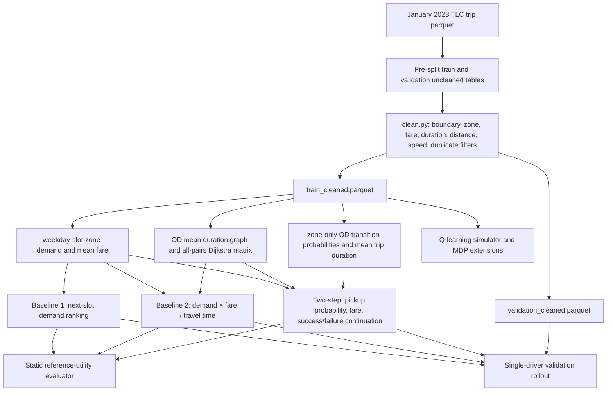

# Research-Grade Audit: NYC Taxi Zone Recommendation

Audit date: 2026-07-25  
Audited commit: `c1afcb6`  
Environment: Windows, Python 3.13.13; repository declares Python 3.10–3.12  
Data used: the complete January 2023 artifacts available in the adjacent `student_release` workspace

> Remediation note: this audit describes the pre-optimization commit named above. The current worktree has replaced hard-coded parameter metrics, added raw temporal splitting, corrected the MDP transition model, made Q-learning reproducible and explicitly simulator-trained, vectorized the main two-step strategy, regenerated public metrics, and rewritten the public documentation. See `outputs/optimization_summary.md` for the post-remediation state.

# Executive Summary

The repository contains a valid course-project implementation of several heuristic taxi-zone ranking rules, but its public-facing scientific claims are not supported at research-paper standard.

The strongest positive finding is that the released training and validation artifacts are temporally separated. The cleaned training data ends at 2023-01-24 23:59:56, validation begins at 2023-01-25 00:00:00, no exact trip overlaps were found, and the released zone-time statistics can be reconstructed exactly from the training split. The baseline implementations also pass the supplied sanity checker.

The central negative finding is that the repository's README, paper, ablation document, and generated report contain metrics that conflict with the actual released experiment artifacts and independent reruns. The claimed NDCG@3 of 0.9978 is actually 0.9565 for the two-step strategy. Claimed baseline NDCGs of 0.9950 and 0.9972 are actually 0.7846 and 0.9024. The claimed 0.24 ms two-step latency is not reproduced by the submitted Python strategy: the original artifact reports 27.97 ms under tracemalloc, this audit measured 22.69 ms under the same static evaluator, and the original rollout reports 4.17 ms without tracemalloc. The reported rollout revenue is broadly reproducible inside the supplied simulator, but it is not evidence of real-world driver revenue improvement.

The static evaluator does not measure observed driver choices or counterfactual revenue. It scores recommendations against a fixed two-step reference-utility vector. Therefore, it is mainly a conformance metric for a particular heuristic objective. A direct horizon experiment demonstrates that NDCG and simulated revenue are not aligned: horizon 1 has higher NDCG than horizon 2, while horizon 5 has lower NDCG than horizon 2 but higher simulated fare.

The simulator is a single-driver stochastic replay model over an immutable historical market. It does not model competing drivers, demand depletion, supply-demand feedback, congestion, equilibrium, or recommendations changing future demand. Trips may be sampled repeatedly, and the model has full access to validation-period cell demand and fares when constructing the market. Its results are useful for controlled within-simulator comparison, but the estimated +3.9% gain over Baseline 2 cannot be interpreted as a deployable market impact.

The proposed two-step method is not a novel reinforcement-learning algorithm. Mathematically, it is a truncated model-based lookahead using a terminal one-step heuristic and a fixed continuation assumption. It is weaker than a full horizon-2 Bellman optimality backup because it does not maximize over future relocation actions. Its novelty is primarily the task-specific combination of empirical demand, fare, OD transition, duration, and candidate pruning.

The Q-learning extension is not offline RL. It runs epsilon-greedy tabular Q-learning inside a simulator estimated from historical aggregates. Logged behavior-policy probabilities and logged relocation actions are absent, making IPS, SNIPS, DR, CQL, and BCQ evaluation of a real recommendation policy unidentifiable from the TLC trip table alone.

Overall, the repository is suitable as a course demonstration after correcting its report, but it is not ready to support top-tier ML/RecSys scientific claims or production deployment.

# Repository Architecture

## Mathematical objectives

### Baseline 1: hot-zone demand

For query time `t`, let `next(t)` be the strictly next half-hour slot. The strategy returns

$$
\mathrm{TopK}_z D(z,\mathrm{next}(t)),
$$

where `D` is the training pickup count. It ignores origin, travel time, fare, supply, and uncertainty.

### Baseline 2: single-step graph utility

For origin `o`, destination `z`, and the next slot used by the implementation:

$$
U_{B2}(o,z,t)=\frac{D(z,t)\bar f(z,t)}{T(o,z)+1}.
$$

The code does not convert demand to pickup probability. The denominator is minutes plus one, while other modules normalize by rounded 30-minute slots, so objectives are inconsistent across the repository.

### Two-step strategy

For a candidate zone `z` at rounded arrival state `s_z`:

$$
p_z=\frac{D(s_z,z)}{D(s_z,z)+240},
$$

$$
V_1(s,z)=p(s,z)\bar f(s,z),
$$

$$
Q_2(o,z,s)=\frac{p_z\left[\bar f(s_z,z)+\gamma\sum_{z'}P(z'\mid z)V_1(s',z')\right]
 +(1-p_z)\gamma V_1(s_z+1,z)}{m(o,z)+1}.
$$

Here `m` is rounded relocation slots. The implementation uses a zone-level, time-invariant OD distribution and one mean duration per pickup zone for every dropoff destination.

### General finite-horizon audit implementation

The added audit planner evaluates the repository's fixed continuation assumption recursively:

$$
V_h(s,z)=p(s,z)\left[\bar f(s,z)+\gamma\sum_{z'}P(z'\mid z)V_{h-1}(s+1+\tau_z,z')\right]
 +(1-p(s,z))\gamma V_{h-1}(s+1,z).
$$

This is truncated policy evaluation for “wait in the reached zone,” not full dynamic programming over future relocation actions.

### Q-learning extension

The extension applies the tabular update

$$
Q(s,a)\leftarrow Q(s,a)+\alpha\left[r+\gamma\max_{a'}Q(s',a')-Q(s,a)\right]
$$

to transitions sampled from its learned simulator. It is online learning in a model-generated environment, not offline learning directly from a fixed transition dataset.

### MDP extension

The intended objective is Bellman optimality:

$$
V^{\star}(s)=\max_a\left[R(s,a)+\gamma\mathbb E[V^{\star}(s')\mid s,a]\right].
$$

The implementation does not realize this taxi MDP correctly; details appear in the high-severity findings.

# Reproduction Summary

## Static evaluator

| Strategy | Claimed NDCG@3 | Reproduced NDCG@3 | Claimed Hit@3 | Reproduced Hit@3 | Reproduced top-1 reference utility |
|---|---:|---:|---:|---:|---:|
| Baseline 1 | 0.9950 | 0.7846 | 0.9970 | 0.5842 | 19.4299 |
| Baseline 2 | 0.9972 | 0.9024 | 0.9984 | 0.8804 | 25.0589 |
| Two-step | 0.9978 | 0.9565 | 0.9988 | 0.9720 | 27.5855 |

The two-step versus Baseline 2 per-query NDCG difference is 0.0541 with a naive query bootstrap 95% CI [0.0510, 0.0570]. This interval is descriptive only: queries share the same aggregate model and are not independent market samples.

## Rollout evaluator

| Strategy | Mean daily fare | Population SD over 100 seeds | Mean served trips | Mean relocations | Mean relocation minutes |
|---|---:|---:|---:|---:|---:|
| Baseline 1 | 431.21 | 37.92 | 133.91 | 163.95 | 2911.58 |
| Baseline 2 | 548.77 | 72.62 | 107.01 | 130.71 | 2578.40 |
| Two-step | 570.61 | 65.23 | 91.69 | 122.28 | 2814.55 |

Paired-seed comparisons:

| Comparison | Mean difference | Bootstrap 95% CI | Paired t p-value | Wilcoxon p-value | Cohen dz |
|---|---:|---:|---:|---:|---:|
| Two-step - Baseline 1 | +139.40/day | [123.31, 153.96] | 1.07e-32 | 2.76e-16 | 1.784 |
| Two-step - Baseline 2 | +21.84/day | [5.00, 39.53] | 0.0151 | 0.000408 | 0.247 |
| Baseline 2 - Baseline 1 | +117.57/day | [100.29, 133.08] | 1.02e-24 | 2.69e-15 | 1.376 |

These intervals measure Monte Carlo seed variation under one fixed simulator. They do not include uncertainty from sampling another week, demand drift, model estimation, competing drivers, or deployment effects.

## Horizon comparison

| Horizon | NDCG@3 | Hit@3 | Static coverage | Mean daily fare | Rollout SD | Query latency |
|---|---:|---:|---:|---:|---:|---:|
| 1 | 0.9582 | 0.9783 | 13.69% | 569.78 | 50.21 | 0.031 ms |
| 2 | 0.9565 | 0.9714 | 14.07% | 570.61 | 65.23 | 0.032 ms |
| 3 | 0.9549 | 0.9759 | 14.45% | 573.47 | 43.46 | 0.031 ms |
| 5 | 0.9525 | 0.9741 | 14.45% | 575.97 | 37.74 | 0.032 ms |
| Adaptive | 0.9559 | 0.9735 | 14.07% | 573.31 | 50.20 | 0.068 ms |

The latency figures in this table are from the added vectorized, precomputed audit planner and are not the latency of the submitted Python-loop implementation.

# Critical Findings

## C1. Public scientific metrics are inconsistent with released artifacts

- Severity: Critical
- Files involved: `README.md`, `paper/index.md`, `report/report.tex`, `docs/ablation_study.md`, `docs/methodology.md`, `outputs/evaluation_report.md`, `src/2_recommendation_algorithm/parameter_selection.py`
- Root cause: Public-facing documents use a repeated set of unsupported values. The parameter-selection module returns the same hard-coded NDCG, hit rate, and latency for every parameter pair without running the strategy.
- Why it matters: The principal performance, ablation, latency, and parameter-selection claims cannot be trusted. This alone invalidates a paper submission until every table is regenerated from saved, versioned experiment outputs.
- Estimated metric impact: two-step NDCG is overstated by 0.0413 absolute; Baseline 1 by 0.2104; Baseline 2 by 0.0948. Two-step static latency is understated by roughly 95–115× versus the original/current tracemalloc evaluator and about 17× versus the original rollout measurement.
- Recommended fix: Delete all hand-entered result tables. Make one experiment runner produce machine-readable per-query/per-run artifacts, then generate README, paper, and plots directly from those artifacts. Fail CI when reported values differ from current artifacts.

## C2. Static NDCG/Hit are circular conformance metrics, not recommendation quality

- Severity: Critical
- Files involved: `src/eval/public_validation.py:27`, `src/eval/validation_core.py:13`, public `validation_answers.parquet`
- Root cause: Relevance is a 263-dimensional “reference two-step utility,” not observed passenger matching, driver acceptance, realized fare, or an optimal counterfactual action.
- Why it matters: A strategy designed to approximate the reference formula receives high NDCG by construction. High NDCG cannot establish real recommendation usefulness or revenue lift.
- Estimated metric impact: The direction is proven non-monotone. Horizon 1 has higher NDCG than horizon 2 but slightly lower rollout fare; horizon 5 has lower NDCG than horizon 2 but +5.16/day higher rollout fare.
- Recommended fix: Rename metrics to “reference-objective NDCG/Hit.” Treat them as implementation diagnostics. Use a separate, policy-relevant test protocol for revenue or service outcomes.

## C3. Revenue gains are simulator-specific and omit market response

- Severity: Critical
- Files involved: `src/eval/rollout_core.py:89`, `src/eval/rollout_core.py:199`, `src/eval/validation_rollout.py:57`
- Root cause: The simulator models one driver against an immutable historical demand table. There is no driver competition, demand depletion, congestion, supply response, equilibrium, or recommendation-induced demand change.
- Why it matters: Sending many drivers to JFK would materially reduce each driver's pickup probability and increase congestion/queueing. The reported gain assumes those effects do not exist.
- Estimated metric impact: Not identifiable from the repository. Bias is plausibly upward for concentrated policies and can be arbitrarily large as deployed fleet size grows.
- Recommended fix: Build a multi-agent event simulator with finite passenger arrivals, queueing, zone-level supply, demand depletion, travel-time congestion, and policy-dependent state evolution. Calibrate and validate it on held-out days before using it for claims.

# High Severity Findings

## H1. Public validation is used for both parameter selection and final reporting

- Severity: High
- Files involved: `src/3_extension_task/extension_2_parameter_sensitivity.py:203`, `src/2_recommendation_algorithm/parameter_selection.py:19`, `docs/methodology.md`
- Root cause: The same 3,360 public validation queries and labels are used to choose gamma, pickup saturation, and candidate-pool size and then to report final NDCG/Hit.
- Why it matters: Reported static metrics are selection-biased. The repository has no untouched temporal test set.
- Estimated metric impact: Unknown. Actual sensitivity is substantial: K=20 gives NDCG 0.5209 and Hit 0.0497; K=100 gives 0.9565 and 0.9720. Searching this space on the reported set can materially inflate results.
- Recommended fix: Use rolling temporal folds for development and reserve the final week/month as a locked test. The audit adds `rolling_time_splits`, strict partition checks, and overlap tests.

## H2. The simulator reuses historical demand without depletion

- Severity: High
- Files involved: `src/eval/rollout_core.py:276-295`
- Root cause: A successful pickup samples a trip uniformly from an immutable cell. The trip remains available for subsequent attempts and other simulated drivers/runs.
- Why it matters: The simulation can repeatedly monetize the same historical demand and cannot estimate fleet-wide effects.
- Estimated metric impact: Upward and policy-dependent; largest for concentrated zones and repeated visits. Not quantifiable without a depletion-aware counterfactual.
- Recommended fix: Represent each passenger arrival as a consumable event; match it to at most one driver.

## H3. Recommendation concentration creates severe airport saturation risk

- Severity: High
- Files involved: two-step prediction artifacts, `src/2_recommendation_algorithm/improved_strategy.py`
- Root cause: The objective rewards high mean fare and does not penalize supply concentration, airport queues, or market saturation.
- Why it matters: On static queries, two-step weighted exposure is 55.0% JFK and 15.4% LaGuardia. Airports receive 70.4% total exposure. The effective exposure count is only 5.53 zones and Gini is 0.982.
- Estimated metric impact: The single-driver simulator likely overstates benefits precisely where the policy is most concentrated.
- Recommended fix: Add supply-aware pickup probability, exposure regularization, per-zone capacity, and a revenue/fairness Pareto analysis.

## H4. The MDP solver is mathematically invalid for the stated taxi process

- Severity: High
- Files involved: `src/4_mdp/mdp_solver.py:73-116`, `src/4_mdp/mdp_solver.py:118-152`
- Root cause: Staying in a zone returns the same state without consuming a pickup-attempt slot, allowing repeated reward at the same state. Success/failure and passenger dropoff transitions are absent. Policy extraction calls `_compute_arrival_state(dest_idx, dest_idx, state)`, so every candidate is treated as a stay action. `current_location_id` is ignored when extracting the policy.
- Why it matters: The value function, convergence claim, and “globally optimal” description do not correspond to the proposed MDP. Recommendations are origin-independent.
- Estimated metric impact: Potentially total invalidation of all MDP results; no valid MDP result artifact is provided.
- Recommended fix: Define a semi-MDP transition kernel including relocation, pickup success/failure, passenger destination, and elapsed time. Extract `Q(s,a)` using the actual current origin and action-specific transitions.

## H5. Q-learning is mislabeled as offline RL and is non-reproducible

- Severity: High
- Files involved: `src/3_extension_task/extension_5_qlearning.py:119-218`, `report/qlearning_analysis.md`
- Root cause: Training samples new transitions with epsilon-greedy exploration from an estimated simulator. It does not learn from a fixed logged batch. The configured seed is never applied to Python or NumPy RNGs.
- Why it matters: Offline-RL validity, coverage, behavior-policy support, and reproducibility claims do not apply. Reported numbers differ from the saved original artifact: the document states 190.9 while the artifact reports 176.33.
- Estimated metric impact: Run-to-run variation is expected; scientific comparison to Baseline 2 is not controlled by paired seeds.
- Recommended fix: Relabel it “tabular Q-learning in a learned simulator.” Seed all RNGs and save learning curves. Do not use CQL/BCQ until actual logged reposition actions and behavior propensities are available.

## H6. The repository is not end-to-end reproducible from the documented raw input

- Severity: High
- Files involved: `src/1_data_clean/clean.py:127-149`, `configs/config.yaml:14-24`, `README.md`, `Makefile`
- Root cause: `clean.py` expects pre-created `data/processed/train_uncleaned.parquet` and `validation_uncleaned.parquet`; it does not ingest and split the documented raw January parquet. The raw path in config is unused by the cleaning entry point.
- Why it matters: A fresh clone plus the advertised raw file cannot execute the documented pipeline.
- Estimated metric impact: Reproducibility failure rather than direct metric bias.
- Recommended fix: Add a deterministic raw-to-split ingestion stage and record raw-file checksum, schema, row counts, and boundaries.

# Medium Severity Findings

## M1. Two-step is one-step lookahead with a terminal heuristic, not full horizon-2 optimal planning

- Severity: Medium
- Files involved: `src/2_recommendation_algorithm/improved_strategy.py:55-74`
- Root cause: Continuation value evaluates only waiting in the passenger dropoff/current zone. There is no future maximization over relocation actions.
- Why it matters: “Two-step finite-horizon planning” is defensible only with a narrow definition. Claims of Bellman-optimal or general planning behavior would be incorrect.
- Estimated metric impact: The horizon audit shows longer fixed-continuation evaluation changes rollout fare by several dollars per day, but this still is not optimized multi-step control.
- Recommended fix: State the continuation policy explicitly or implement a true action-maximizing finite-horizon DP.

## M2. Transition and duration models discard important conditioning

- Severity: Medium
- Files involved: `src/2_recommendation_algorithm/improved_strategy.py:127-161`
- Root cause: `P(dropoff|pickup)` is pooled across all weekdays and slots; trip duration is averaged only by pickup zone and then reused for every destination.
- Why it matters: Airport, rush-hour, and cross-borough trips have strongly different destination and duration distributions.
- Estimated metric impact: Unknown. Removing OD transitions below probability 0.001 barely changes policy (99.84% Top-3 overlap), suggesting much of the sparse OD detail is not influential under the current objective.
- Recommended fix: Estimate smoothed `P(z', duration_bin | z, weekday, slot)` with hierarchical backoff and report calibration on held-out time blocks.

## M3. Pickup probability is an uncalibrated demand transform

- Severity: Medium
- Files involved: `src/2_recommendation_algorithm/improved_strategy.py:51-53`, `src/eval/rollout_core.py:82-86`
- Root cause: `D/(D+240)` and `n/(n+40)` are assumed, not estimated from observed driver supply, wait times, or pickup success.
- Why it matters: Demand alone cannot identify a driver's pickup probability; supply is missing.
- Estimated metric impact: Potentially large and concentration-dependent.
- Recommended fix: Calibrate pickup hazards using matched driver availability/supply data or treat the transform as a scenario parameter, not a probability claim.

## M4. Parameter semantics and documentation are inconsistent

- Severity: Medium
- Files involved: `configs/config.yaml:45-53`, `docs/ablation_study.md`, `README.md`
- Root cause: `lambda_param=1.0` is unused; pickup half-saturation is 240; documents sometimes call lambda relocation normalization and elsewhere call it pickup saturation with values 0.5, 1, and 2.
- Why it matters: The reported sensitivity table cannot be mapped unambiguously to executable code.
- Estimated metric impact: Invalidates the stated lambda conclusions.
- Recommended fix: Give each parameter one name, unit, formula, and config source. Assert that experiment overrides actually change runtime values.

## M5. Reported ablations are not backed by executable experiments

- Severity: Medium
- Files involved: `docs/ablation_study.md`, `outputs/evaluation_report.md`
- Root cause: No runner or artifact supports the cleaning, transition, duration, K=150/263, or stated fare-contribution tables.
- Why it matters: Component attribution and “near-optimal” conclusions cannot be checked.
- Estimated metric impact: Unknown; the actual parameter artifact contradicts several claims, including gamma=0.5 being best at K=50.
- Recommended fix: Implement each ablation as a named config, run with paired seeds, and save per-run outcomes.

## M6. Statistical significance was previously omitted

- Severity: Medium
- Files involved: all public result documents
- Root cause: Only point estimates were reported.
- Why it matters: The two-step versus Baseline 2 effect is small relative to seed variability (dz=0.245), even though it is significant in the fixed simulator.
- Estimated metric impact: Claims of practically large improvement are overstated.
- Recommended fix: Report mean, SD, paired bootstrap CI, paired t-test, Wilcoxon, and effect size. Use day/week block bootstrap for real held-out markets.

## M7. Robustness to missing cells is weak

- Severity: Medium
- Files involved: added `scripts/run_robustness_audit.py`
- Root cause: Sparse zone-time cells fall directly to zero with no hierarchical smoothing.
- Why it matters: Randomly masking 10% of demand/fare cells reduces NDCG from 0.9565 to 0.9042 and Hit from 0.9714 to 0.7872; Top-3 overlap falls to 81.37%.
- Estimated metric impact: Large under incomplete or drifting feeds.
- Recommended fix: Use empirical-Bayes shrinkage and weekday/slot/zone backoff, with explicit missingness indicators.

## M8. ML baseline evidence is scientifically irrelevant

- Severity: Medium
- Files involved: `benchmark/run_ml_baselines.py`, `benchmark/ml_benchmark_results.json`, `README.md`
- Root cause: Models are trained and tested on synthetic IID rows where demand is directly provided as a feature for a target constructed from demand. The planner is not evaluated in the same benchmark. Scikit-learn is not in project dependencies.
- Why it matters: The reported R² cannot support superiority over ML recommenders.
- Estimated metric impact: Entire ML comparison claim unsupported.
- Recommended fix: Train temporal baselines on real training months and evaluate on later months using the same action and reward definitions.

# Low Severity Findings

## L1. Test count, pass count, and coverage claims are stale

- Severity: Low
- Files involved: `README.md`, `pyproject.toml`, CI workflow
- Root cause: README states 41 tests/26 pass. With data present, this audit ran 72 tests, all passing, at 17% aggregate source coverage. Without data, core strategy tests skip and coverage was 6%.
- Why it matters: The badge suggests broader verification than exists; cleaning, Dijkstra, evaluators, Q-learning, and MDP have little or no direct coverage.
- Recommended fix: Publish CI-derived test/coverage badges and add integration tests with a small fixture dataset.

## L2. README evaluation commands use an incorrect import path

- Severity: Low
- Files involved: `README.md`
- Root cause: Commands set `PYTHONPATH=.` while evaluator modules import `eval.*`; the working command requires `PYTHONPATH=src` or both root and `src`.
- Why it matters: Documented reproduction fails with `ModuleNotFoundError: eval`.
- Recommended fix: Use module invocation consistently: `PYTHONPATH=src python -m eval.public_validation ...`.

## L3. The no-data example fails on Windows GBK terminals

- Severity: Low
- Files involved: `examples/basic_usage.py`
- Root cause: It prints Unicode checkmark characters without handling non-UTF-8 console encoding.
- Why it matters: The advertised “without data” tour crashed in this audit.
- Recommended fix: Use ASCII fallback or configure UTF-8 output.

## L4. Docker reproducibility is unverified and the Dockerfile build order is fragile

- Severity: Low
- Files involved: `Dockerfile`
- Root cause: The builder copies only `requirements.txt` and `pyproject.toml`, then runs `pip install ".[dev]"` before copying README/source. The local Docker daemon was unavailable, so a full build could not be executed.
- Why it matters: PEP 621 metadata references README, and package discovery may not see source at that build layer.
- Recommended fix: Copy README and package source before installing the local project, or install only dependencies in the builder cache layer and install the project after `COPY . .`.

# Temporal Data Leakage Audit

## Findings

| Check | Result |
|---|---|
| Train/validation boundary | Pass: train ends before validation begins |
| Exact cross-split duplicate trips | Pass: 0 |
| Zone-time demand/fare built only from train | Pass: exact reconstruction |
| Travel-time matrix source | Train only |
| OD transitions and mean durations | Train only |
| Strategy reads validation files at inference | No |
| Same public validation used for tuning and reporting | Fail |
| Untouched temporal test set | Missing |

There is no evidence that the released primary strategy directly reads future validation demand at recommendation time. The major temporal-validity failure is selection/evaluation reuse, not contamination of the released training statistics.

The audit adds:

- strict temporal partition validation;
- exact cross-split trip-overlap detection;
- expanding rolling-window split generation;
- unit tests for chronology and overlap behavior.

A recommended two-fold January protocol is:

1. Train Jan 1–14, validate Jan 15–21.
2. Train Jan 1–21, validate Jan 22–28.
3. Lock Jan 29–31 only for a final descriptive check, while acknowledging the short horizon.

For publication, multiple months are required so that seasonal and market-regime uncertainty can be estimated.

# Evaluation Validity and Counterfactual Audit

## What is actually evaluated?

- Static NDCG/Hit: agreement with a fixed reference utility, not historical driver behavior and not optimal behavior.
- Rollout fare: performance under a hand-specified historical-market simulator.
- Neither evaluation observes what would have happened if a historical driver had received another recommendation.

## Can IPS, SNIPS, or DR be computed?

No valid TLC-data estimate is identifiable because the logs lack:

- the recommendation action shown to a driver;
- the logging policy probability of that action;
- driver acceptance/compliance;
- rewards for rejected/unselected actions;
- a stable unit unaffected by other drivers.

The audit implements tested IPS, SNIPS, and doubly robust estimators in `src/audit/counterfactual.py`. Their correct result on this repository is “not identifiable,” not a fabricated number.

To enable valid OPE, a future deployment must log context, complete candidate set, randomized action probabilities, shown ranking, driver response, realized reward window, and interference group. Cluster-randomized or switchback experiments are preferable because drivers interfere through shared demand.

# Simulator Audit

| Property | Current simulator |
|---|---|
| Historical replay | Uses historical validation cells as a stochastic generative table |
| Recommendations influence future demand | No |
| Driver competition | No |
| Supply-demand feedback | No |
| Demand depletion | No |
| Congestion | No |
| Equilibrium behavior | No |
| Multi-driver interference | No |
| Trip reuse | Yes |
| Driver compliance | Fixed 0.6/0.3/0.1 rank sampling |

## Recommended simulator architecture

1. Event stream of finite passenger arrivals by timestamp, pickup zone, destination, and fare.
2. Population of drivers with locations, availability, compliance, and heterogeneous preferences.
3. Dispatch/matching that consumes each passenger once.
4. Zone queues and pickup hazards dependent on both demand and available supply.
5. Congestion-dependent travel time and airport queue rules.
6. Policy decisions that alter future driver distribution.
7. Calibration on training months and validation on later held-out months.
8. Sensitivity across fleet size, compliance, demand shocks, and competitor policies.

# Algorithmic Novelty Review

Let `B` be the Bellman expectation operator under a fixed continuation policy that waits in the reached zone. With terminal heuristic `V1=p×fare`, the repository computes approximately

$$
Q_2(s,a)=r(s,a)+\gamma\mathbb E[V_1(s')\mid s,a],
$$

followed by an external relocation normalization and candidate pruning. This is one truncated backup. It is not full Bellman optimality because the continuation is not

$$
\max_{a'}Q_1(s',a').
$$

It is also not standard exact finite-horizon DP because transitions use aggregated zone-only OD probabilities and mean duration, and the objective divides by movement slots outside the transition/reward model.

Closest methodological categories include finite-horizon dynamic programming, rollout/one-step lookahead with a terminal heuristic, approximate dynamic programming, receding-horizon control, and model-based fleet repositioning. Standard references a reviewer would invoke include Bertsekas and Tsitsiklis on neuro-dynamic programming/rollout, Powell on approximate dynamic programming, and prior ride-hailing fleet-management/order-dispatch work using model-based planning or multi-agent RL.

Novelty assessment: a reviewer can reasonably write, “This is horizon-2 lookahead with empirical transitions and heuristic pruning.” A more precise criticism is, “This is one-step lookahead over the initial relocation action with fixed-policy terminal evaluation, not a fully optimized horizon-2 MDP.”

# Offline RL Audit

The taxi trip table records passenger trips, not driver reposition decisions under a known behavior policy. Consequently:

- behavior action probabilities are unavailable;
- exploration of relocation actions is unobserved;
- missing actions are not distinguishable from actions with zero reward;
- standard offline-RL support assumptions cannot be checked.

Fitted Q Iteration, CQL, and BCQ would not solve this identification problem. Applying them by treating passenger pickup zones as chosen reposition actions would redefine the task incorrectly. If only the present data are available, model-based value iteration over an explicitly estimated simulator is more honest. If future logs include randomized reposition recommendations and outcomes, FQI/CQL can be considered with strict temporal splits and OPE/A-B validation.

# Statistical Rigor

The added statistics module reports paired bootstrap confidence intervals, paired t-tests, Wilcoxon signed-rank tests, and Cohen's dz. The two-step gain over Baseline 2 is statistically detectable in the fixed simulator but small in standardized magnitude.

No inferential procedure in this audit resolves external validity. Proper publication inference should resample independent days/weeks or use block bootstrap, not treat 3,360 correlated queries as independent observations.

# Robustness Analysis

## Parameter sensitivity from the actual saved artifact

- At K=50, gamma 0.5 gives NDCG 0.8457; gamma 1.0 gives 0.8990. This contradicts the public claim that gamma 0.5 is optimal.
- K=20 collapses to NDCG 0.5209 and Hit 0.0497.
- K=100 improves to NDCG 0.9565 and Hit 0.9720.
- Half-saturation 120 at K=50 outperforms 240 on static NDCG (0.8983 versus 0.8457).

## Perturbation stress tests

| Scenario | NDCG@3 | Hit@3 | Top-3 overlap with baseline |
|---|---:|---:|---:|
| Unperturbed | 0.9565 | 0.9714 | 100% |
| Manhattan demand +50% | 0.9451 | 0.9667 | 88.03% |
| Random 10% missing cells | 0.9042 | 0.7872 | 81.37% |
| Drop OD probabilities <0.001 | 0.9565 | 0.9714 | 99.84% |
| Remove bottom-demand 10% zones | 0.9565 | 0.9714 | 100% |

The complete plot is saved as `outputs/audit_robustness.png`. Insensitivity to removing rare zones is not necessarily robustness; it also shows that these zones have no influence on recommendations.

# Fairness and Market Impact

Weighted exposure uses the simulator's 0.6/0.3/0.1 rank weights.

| Strategy | Coverage | Gini | Effective zones | Manhattan share | Airport share | Premium-fare share |
|---|---:|---:|---:|---:|---:|---:|
| Baseline 1 | 7.98% | 0.974 | 9.22 | 72.26% | 27.74% | 24.94% |
| Baseline 2 | 14.07% | 0.970 | 9.21 | 49.33% | 50.62% | 43.65% |
| Two-step | 15.21% | 0.982 | 5.53 | 29.45% | 70.37% | 55.01% |

The top two-step zones are JFK Airport (55.0%), LaGuardia Airport (15.4%), Times Square/Theatre District (6.4%), and Midtown Center (4.6%). The strategy is more geographically concentrated in effective exposure than both baselines despite nominally recommending more unique zones.

The repository does not establish a fairness/revenue frontier. A defensible formulation would optimize expected driver utility subject to exposure caps, minimum borough/zone coverage, queue capacity, and possibly entropy or Gini constraints. Long-run evaluation must include saturation because exposure fairness and revenue are coupled through supply.

# Engineering and Reproducibility Audit

## Reproducible

- Full data artifacts pass the supplied sanity checker.
- All 72 current tests pass with data available.
- Training/validation boundaries and training statistics are reproducible.
- Baseline and two-step rollout means are reproduced exactly from the original seeds.

## Partially reproducible

- Static two-step metric is reproducible as 0.9565, not the value in the polished repository documents.
- Latency depends heavily on evaluator instrumentation and implementation; public value is not reproducible.
- Docker could not be executed because the local Docker Desktop Linux daemon was unavailable.

## Non-reproducible

- README/paper static tables.
- Stated ablation contributions.
- Parameter-selection table in `parameter_selection.py`.
- “Regret versus optimal” table, which simply defines the best reported method as zero regret without computing an optimum.
- Zone coverage/diversity values in `outputs/evaluation_report.md`.
- Q-learning values quoted in `report/qlearning_analysis.md`.
- ML superiority claim.

# Scores

| Dimension | Score | Rationale |
|---|---:|---|
| Scientific Validity | 2.5/10 | Correct temporal split, but circular static objective, simulator-only revenue, unsupported tables, and invalid MDP/RL claims |
| Engineering Quality | 5.0/10 | Clear modular structure and passing baselines, but fake parameter runner, low effective coverage, broken end-to-end ingestion, and untested extensions |
| Reproducibility | 3.5/10 | Core supplied artifacts rerun, but polished claims and ablations do not match artifacts; fresh-clone raw pipeline is incomplete |
| Novelty | 2.0/10 | Task-specific application of standard truncated lookahead and empirical transitions; no demonstrated algorithmic novelty |
| Production Readiness | 1.5/10 | No supply, competition, congestion, uncertainty calibration, monitoring, or deployment validation |

# Required Revisions for a Top-Tier ML/RecSys Submission

The strongest reviewer criticisms would be:

1. The headline numbers do not match the released artifacts.
2. The primary ranking metric is defined by the proposed heuristic and is therefore circular.
3. The revenue claim comes from a single-driver replay simulator with no interference or market response.
4. There is no untouched temporal test set, no multi-month evaluation, and no credible counterfactual estimator.
5. The method is standard limited-horizon lookahead, while novelty is overstated.
6. The “offline RL” and MDP baselines are not valid implementations of the claimed methods.
7. Statistical, robustness, and fairness analysis was absent from the original report.

Acceptance would require, at minimum:

- regenerate every claim from versioned experiment artifacts;
- add several months of data with rolling train/validation/test splits;
- separate diagnostic reference-objective ranking from real outcome evaluation;
- implement a calibrated multi-driver, demand-depleting simulator or run a randomized field/switchback experiment;
- compare against strong contextual-bandit, forecasting-plus-optimization, approximate-DP, and fleet-management baselines under identical data and actions;
- either reduce the novelty claim to an application paper or contribute a genuinely new planning/learning method with theory;
- remove or replace the invalid MDP/Q-learning experiments;
- report block-bootstrap uncertainty, paired tests, practical effect sizes, and failure analyses;
- include concentration constraints and market-saturation experiments;
- release a one-command raw-data-to-paper pipeline with immutable configs and checksums.

Under the current evidence, the likely top-tier decision is reject. With corrected claims, a stronger simulator, multi-month temporal testing, and a clearly positioned application contribution, the work could become a solid systems/course-project report, but it would still need substantial methodological novelty for a top-tier ML/RecSys research venue.

# Audit Artifacts Added

- `src/audit/temporal.py`: rolling splits and leakage checks
- `src/audit/counterfactual.py`: IPS, SNIPS, and doubly robust estimators
- `src/audit/statistics.py`: paired CI/tests/effect size
- `src/audit/fairness.py`: exposure, coverage, Gini, and entropy
- `src/2_recommendation_algorithm/finite_horizon.py`: horizons 1–5 and adaptive horizon
- `scripts/run_research_audit.py`: data and fairness evidence
- `scripts/run_paired_rollout_audit.py`: paired rollout inference
- `scripts/run_horizon_audit.py`: horizon comparison
- `scripts/run_robustness_audit.py`: perturbation analysis and plot
- `tests/test_research_audit.py`: formula and leakage tests
